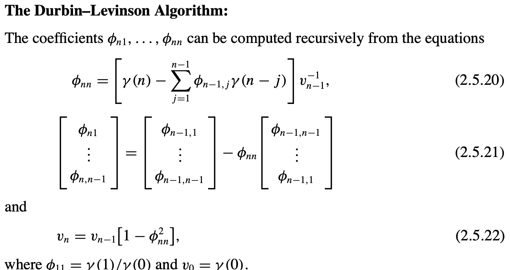

{:toc}

# high-level

## basics

- usually assume points are equally spaced
- modeling - for understanding underlying process or predicting
- [nice blog](https://algorithmia.com/blog/introduction-to-time-series), [nice tutorial](https://www.itl.nist.gov/div898/handbook/pmc/section4/pmc442.htm), [Time Series for scikit-learn People](https://www.ethanrosenthal.com/2018/01/28/time-series-for-scikit-learn-people-part1/)
- *noise*, *seasonality* (regular / predictable fluctuations), *trend*, *cycle*
- multiplicative models: time series = trend * seasonality * noise
- additive model: time series = trend + seasonality + noise
- stationarity - mean, variance, and autocorrelation structure do not change over time
- **endogenous variable = x** = independent variable
- **exogenous variable = y** = dependent variable
- changepoint detection / [Change detection ](https://en.wikipedia.org/wiki/Change_detection) - tries to identify times when the probability distribution of a stochastic process or time series changes

## libraries

- [pandas has some great time-series functionality](https://tomaugspurger.github.io/modern-7-timeseries)
- [skits library](https://github.com/EthanRosenthal/skits) for forecasting

## high-level modelling

- common methods
  - decomposition - identify each of these components given a time-series
    - ex. loess, exponential smoothing
  - frequency-based methods - e.g. look at spectral plot
  - (AR) autoregressive models - linear regression of current value of one or more prior values of the series
  - (MA) moving-average models - require fitting the noise terms
  - (ARMA) box-jenkins approach 
- moving averages
  - simple moving average - just average over a window
  - cumulative moving average - mean is calculated using previous mean
  - exponential moving average - exponentially weights up more recent points
- prediction (forecasting) models
  - autoregressive integrated moving average (arima)
    - assumptions: stationary model

# similarity measures

- [An Empirical Evaluation of Similarity Measures for Time Series Classification](https://arxiv.org/pdf/1401.3973.pdf) (serra et al. 2014)
  - lock-step measures (Euclidean distance, or any norm)
    - can resample to make them same length
  - feature-based measures (Fourier coefficients)
    - euclidean distance over all coefs is same as over time-series, but we usually filter out high-freq coefs
    - can also use wavelets
  - model-based measures (auto-regressive)
    - compare coefs of an AR (or ARMA) model
  - elastic measures
    - dynamic time warping = DTW - optimally align in temporal domain to minimize accumulated cost
      - can also enforce some local window around points
      - Every index from the first sequence must be matched with one or more indices from the other sequence and vice versa
      - The first index from the first sequence must be matched with the first index from the other sequence (but it does not have to be its only match)
      - The last index from the first sequence must be matched with the last index from the other sequence (but it does not have to be its only match)
      - The mapping of the indices from the first sequence to indices from the other sequence must be monotonically increasing, and vice versa, i.e. if `j > i` are indices from the first sequence, then there must not be two indices `l > k` in the other sequence, such that index `i` is matched with index `l` and index `j` is matched with index `k` , and vice versa
    - edit distance EDR
    - time-warped edit distance - TWED
    - minimum jump cost - MJC

# [book1](https://www.stat.tamu.edu/~suhasini/teaching673/time_series.pdf) (A course in Time Series Analysis) + [book2](http://home.iitj.ac.in/~parmod/document/introduction%20time%20series.pdf) (Intro to Time Series and Forecasting)

## ch 1

- when errors are dependent, very hard to distinguish noise from signal
- usually in time-series analysis, we begin by de-trending the data and analyzing the residuals
  - ex. assume linear trend or quadratic trend and subtract that fit (or could include sin / cos for seasonal behavior)
  - ex. look at the differences instead of the points (nth order difference removes nth order polynomial trend). However, taking differences can introduce dependencies in the data
  - ex. remove trend using sliding window (maybe with exponential weighting)
- periodogram - in FFT, this looks at the magnitude of the coefficients (but loses the phase information)

## ch 2 - stationary time series

- in time series, we never get iid data
- instead we make assumptions
  - ex. the process has a constant mean (a type of stationarity)
  - ex. the dependencies in the time-series are short-term
- autocorrelation plots: plot correlation of series vs series offset by different lags
- formal definitions of stationarity for time series $\{X_t\}$
  - **strict stationarity** - the distribution is the same across time
  - **second-order / weak stationarity** -  mean is constant for all t and, for any t and k, the covariance between $X_t$ and $X_{t+k}$ only depends on the lag difference k
    - In other words, there exists a function $c: \mathbb Z \to \mathbb R$ such that for all t and k we have $c(k) = \text{cov} (X_t, X_{t+k})$
    - strict stationary and $E|X_T^2| < \infty \implies$ second-order stationary
  - **ergodic** - stronger condition, says samples approach the expectation of functions on the time series: for any function $g$ and shift $\tau_1, ... \tau_k$:
    - $\frac 1 n \sum_t g(X_t, ... X_{t+\tau_k}) \to \mathbb E [g(X_0, ..., X_{t+\tau_k} )]$
- **causal** - can predict given only past values (for Gaussian processes no difference)

## ch 3 - linear time series

**note: can just assume all have 0 mean (otherwise add a constant)**

- **AR model** $AR(p)$:  $$ X_t = \sum_{i=1}^p \phi_i X_{t-i}+ \varepsilon_t $$
  - $\phi_1, \ldots, \phi_p$ are parameters
  - $\varepsilon_t$ is white noise
  - stationary assumption places constraints on param values (e.g. processes in the $AR(1)$ model with $|\phi_1| \ge 1$ are not stationary)
  - looks just like linear regression, but is more complex
    - if we don't account for issues, things can go wrong
      - model will not be stationary
      - model may be misspecified
      - $E(\epsilon_t|X_{t-p}) \neq 0$
    - this represents a set of difference equations, and as such, must have a solution
  - ex. $AR(1)$ model - if $|\phi| < 0$, then soln is in terms of past values of {$\epsilon_t$}, otherwise it is in terms of future values
    - ex. simulating - if we know $\phi$ and $\{\epsilon_t\}$, we still need to use the backshift operator to solve for  $\{ X_t \}$
  - ex. $AR(p)$ model - if $\sum_j |\phi_j|$< 1, and $\mathbb E |\epsilon_t| < \infty$, then will have a causal stationary solution
  - **backshift operator** $B^kX_t=X_{t-k}$
    - solving requires using the backshift operator, because we need to solve for what all the residuals are
  - **characteristic polynomial** $\phi(a) = 1 - \sum_{j=1}^p \phi_j a^j$
    - $\phi(B) X_t = \epsilon_t$
    - $X_t=\phi(B)^{-1} \epsilon_t$
  - can represent $AR(p)$ as a vector $AR(1)$ using the vector $\bar X_t = (X_t, ..., X_{t-p+1})$
  - note: can reparametrize in terms of frequencies
- **MA model** $MA(q)$: $ X_t = \sum_{i=1}^q \theta_i \varepsilon_{t-i} + \varepsilon_t$
  - $\theta_1 ... \theta_q$ are params
  - $\varepsilon_t$, $\varepsilon_{t-1}$ are white noise error terms
  - harder to fit, because the lagged error terms are not visible (also means can't make preds on new time-series)
  - $E[\epsilon_t] = 0$, $Var[\epsilon_t] = 1$
  - much harder to estimate these parameters
  - $X_t = \theta (B) \epsilon_t$ (assuming $\theta_0=1$)
- **ARMA model**: $ARMA(p, q)$: $X_t = \sum_{i=1}^p \phi_i X_{t-i} + \sum_{i=1}^q \theta_i \varepsilon_{t-i} + \varepsilon_t$
  - $\{X_t\}$ is stationary
  - $\phi (B) X_t = \theta(B) \varepsilon_t$
  - $\phi(B) = 1 - \sum_{j=1}^p \phi_j B^j$
  - $\theta(B) = 1 + \sum_{j=1}^{q}\theta_jz^j$
  - **causal** if $\exists \{ \psi_j \}$ such that $X_t = \sum_{j=0}^\infty \psi_j Z_{t-j}$ for all t

- **ARIMA model**: $ARIMA(p, d, q)$: - generalizes ARMA model to non-stationarity (using differencing)

## ch 4 + 8 - the autocovariance function + parameter estimation

- estimation
  - pure autoregressive
    - Yule-walker
    - Burg estimation - minimizing sums of squares of forward and backward one-step prediction errors with respect to the coefficients
  - when $q > 0$
    - innovations algorithm
    - hannan-rissanen algorithm
- autocovariance function: {$\gamma(k): k \in \mathbb Z$} where $\gamma(k) = \text{Cov}(X_{t+h}. X_t) =  \mathbb E (X_0 X_k)$ (assuming mean 0)
- 
- **Yule-Walker equations** (assuming AR(p) process): $\mathbb E (X_t X_{t-k}) = \sum_{j=1}^p \phi_j \mathbb E (X_{t-j} X_{t-k}) + \underbrace{\mathbb E (\epsilon_tX_{t-k})}_{=0} = \sum_{j=1}^p \phi_j \mathbb E (X_{t-j} X_{t-k})$
  - ex. MA covariance becomes 0 with lag > num params
- can rewrite the Yule-Walker equations

  - $\gamma(i) = \sum_{j=1}^p \phi_j \gamma(i -j)$
  - $\underline\gamma_p = \Gamma_p \underline \phi_p$
    - $(\Gamma_p)_{i, j} = \gamma(i - j)$
    - $\hat{\Gamma}_p$ is nonegative definite (and nonsingular if there is at least one nonzero $Y_i$)
  - $\underline \gamma_p = [\gamma(1), ..., \gamma(p)]$
  - $\underline \phi_p = (\phi_1, ..., \phi_p)$
    - this minimizes the mse $\mathbb E [X_{t+1} - \sum_{j=1}^p \phi_j X_{t+1-j}]^2$
- use estimates to solve: $\hat{\underline \phi}_p = \hat \Sigma_p^{-1} \hat{\underline r}_p $
- the innovations algorithm
  - set $\hat X_1 = 0$
  - **innovations** = one-step prediction errors $U_n = X_n - \hat X _n$
- **mle** (ch 5.2)
  - eq. 5.2.9: Gaussian likelihood for an ARMA process
  - $r_n = \mathbb E[(W_{n+1} - \hat W_{n+1})^2]$

# multivariate time-series ch 7

- vector-valued time-series has dependencies between variables across time
  - just modeling as univariate fails to take into account possible dependencies between the series

# neural modeling

- see [pytorch-forecasting](https://pytorch-forecasting.readthedocs.io/en/latest/api/pytorch_forecasting.models.html#module-pytorch_forecasting.models) for some new state-of-the-art models