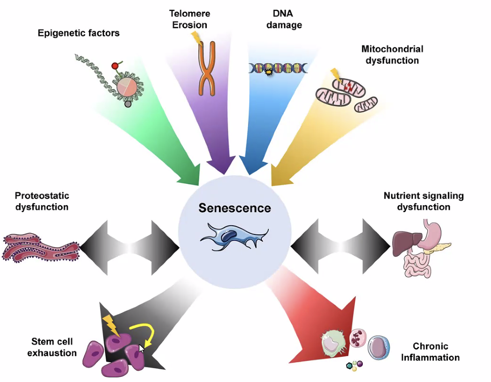

# The Mathematical Essence of Aging

**Uri Alon, Weizmann Institute of Science**

- same genes + same environments - people still die at different times
- risk of death (probability of dying in a given year) doubles every 8 years (gompertz law)

## senescent cells

- senescenent cells are damaged cells that stop dividing
- function - instead of dividing, these cells
  - commit **apoptosis** - cell suicide
  - or become a zombie cell
- these cells are crucial in wound-healing
  - secrete pro-inflammatory signals inhibiting regeneration, and cause legions
  - "garbage trucks" come in and remove these to help wound
- these cells accumulate with age in different tissues (almost exponentially)
  - inflammaging - our whole body fills with inflammation
- removal of senescent cells reverses aging-related decline in mice (baker nature 2016)
- different damage theories lead to senescence (e.g. telomeres)
  - 
- senolytic drugs - targe senescence cells specifically

## mathematics

- do these cells accumulate passively or in a balance?
- what is their half-life?