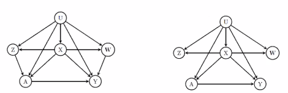

# an intro to proximal causal learning

**eric tchetgen tchetgen, wharton**

- measured covariates are rarely good enough to satisfy exchangeability
- ex. effect of RHC on 30-day survival in ICU
  - obv confounding: patients with RHC performed, were sicker
  - original study used propensity score matching  based on 73 covariates and found that RHC had negative effect
- standard assumptions
  - consistency / SUTVA: $Y=Y_A$
  - positivity: $f(A=a|L) > 0$
  - exchangeability: $Y_a \perp A|L$
- then, we get the *g-formula*: $\beta(a)=\sum_{l} E(Y \mid a, l) f(I)$
- proximal study design assumptions are fairly general
  - allows us to adjust for a certain structure of unmeasured confounding $U$
  - 