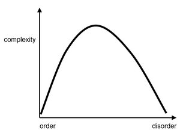

[TOC]

Complexity can be a useful notion for many things in statistical models. It can help answer the following questions:

- can I interpret this model?
- how many samples should I collect?
- is my model a good fit for this problem?
- model class selectiondirectionsmore stable (e.g. LOOCV, deletion, weights)interpolating estimator w/ lowest var?
- set an err threshold and then look at stability

# philosophy

- [What is complexity?](http://cogprints.org/357/4/evolcomp.pdf) (edmonds 95)
  - complexity is only really useful for comparisons
  - properties
    - size - makes things potentially complex
    - ignorance - complex things represent things we don't understand (e.g. the brain)
    - minimum description size - more about **information** than complexity
      - potential problem - expressions are not much more complex than the original axioms in the system, even though they can get quite complex
      - potential problem - things with lots of useless info would seem more complex
    - some variety is necessary but not sufficient
    - order - we sometimes find order comes and goes (like double descent) - has a lot to do with language (audience)
  - defn: "that property of a language expression which makes it difficult to formulate its overall behaviour even when given almost complete information about its atomic components and their inter-relations"
    - language matters - what about the system are we describing?
    - goal matters - what outcome are interested in?
- [On Complexity and Emergence](https://arxiv.org/abs/nlin/0101006) (standish 01)
  - definition close to Kolmogorov / shannon entropy
  - adds context dependence
  - kolmogorov complexity = algorithmic information complexity
    - problem 1: must assume a particular Universal Turing machine (which might give differing results)
    - problem 2: random sequences have max complexity, even though they contain no information
  - soln
    - incorporate context - what descriptions are the same?
    - $C(x) = \lim _{\ell \to \infty} \log_2 N - \log_2 \omega (\ell, x)$
      - where C(x) is the complexity (measured in bits), $\ell(x)$ the length of the description, N the size of the alphabet used to encode the description and ω(ℓ,x) the size of the class of all descriptions of length less than ℓ equivalent to x.
  - emergence - ex. game of life
- [What is complexity 2](https://link.springer.com/chapter/10.1007/978-3-642-50007-7_2) (Gell-Mann 02)
  - AIC - algorithmic information content - contains 2 terms
    - effective complexity (EC) = the length of a very concise description of an entity's regularities
      - regularities are judged subjectively (e.g. birds would judge a bird song's regularity)
    - 2nd term relating to random features
- [complexity](http://www.scholarpedia.org/article/Complexity) (Sporns 07)
  - complexity = degree to which **components** engage in organized structured **interactions**
  - High complexity -> mixture of order and disorder (randomness and regularity) + have a high capacity to generate **emergent** phenomena.
  - (simon 1981): complex systems are “made up of a large number of parts that have many interactions.”
  - 2 categories
    - algorithmic / mdl
    - natural complexity (e.g. physical complexity)
      - 
- [quanta article](https://www.quantamagazine.org/computer-science-and-biology-explore-algorithmic-evolution-20181129/?fbclid=IwAR0rSImplo7lLM0kEYHrHttx8qUimB-482dI9IFxY6dvx0CFeEIqzGuir_w)
  - "the probability of producing some types of outputs is far greater when randomness operates at the level of the program describing it rather than at the level of the output itself"
  - "they [recently reported in *Royal Society Open Science*](http://rsos.royalsocietypublishing.org/content/5/8/180399) that, compared to statistically random mutations, this mutational bias caused the networks to evolve toward solutions significantly faster."

# computational complexity

- amount of computational resource that it takes to solve a class of problem
- [Computational complexity](https://dl.acm.org/citation.cfm?id=1074233) (Papadimitriou)
  - like run times of algorithms etc. $O(n)$
- [Parameterized complexity](https://www.researchgate.net/profile/Michael_Fellows/publication/2376092_Parameterized_Complexity/links/5419e9240cf25ebee98883da/Parameterized-Complexity.pdf) (Downey and Fellows)
  - want to solve problems that are NP-hard or worse, so we isolate input into a parameter

# bayesian model complexity

- [Bayesian measures of model complexity and fit](https://rss.onlinelibrary.wiley.com/doi/full/10.1111/1467-9868.00353) (spiegelhalter et al.)
- AIC
- BIC
- [TIC](https://arxiv.org/pdf/1803.04947.pdf)

# statistical learning theory

- VC-dimension - measure of capacity of a function class that can be learned
  - cardinality of largest number of points which can be shattered

# misc

- [rashomon curves](https://arxiv.org/abs/1908.01755) (semenova & rudin, 2019)
  - **rashomon effect** - many different explanations exist for same phenomenon
  - **rashomon set** - set of almost-equally accurate models for a given problem
  - **rashomon ratio** - ratio of volume of set of accurate models to the volume of the hypothesis space
  - **rashomon curve** - empirical risk vs rashomon ratio
    - **rashomon elbow** - maximize rashomon ratio while minimizing risk
      - good for model selection
- bennet's logical depth (1988) - computational resources taken to calculate the results of a minimal length problem (combines computational complexity w/ kolmogorov complexity)
- Effective measure complexity (Grassberger, 1986) quantifies the complexity of a sequence by the amount of information contained in a given part of the sequence that is needed to predict the next symbol
- Thermodynamic depth (Lloyd and Pagels, 1988) relates the entropy of a system to the number of possible historical paths that led to its observed state
- lofgren's interpretation and descriptive complexity
  - convert between system and description
- kaffman's number of conflicting constraints
- Effective complexity (Gell-Mann, 1995) measures the minimal description length of a system’s regularities
- Physical complexity (Adami and Cerf, 2000) is related to effective complexity and is designed to estimate the complexity of any sequence of symbols that is about a physical world or environment
- Statistical complexity (Crutchfield and Young, 1989) is a component of a broader theoretic framework known as computational mechanics, and can be calculated directly from empirical data
- Neural complexity (Tononi et al., 1994) - multivariate extension of mutual information that estimates the total amount of statistical structure within an arbitrarily large system.= the difference between the sum of the component’s individual entropies and the joint entropy of the system as a whole
- complexity = variance of the model predictions (given that there is zero bias)

# estimated

- [optimal m estimation in high dimensions](https://www.pnas.org/content/110/36/14563) optimal loss function (optimize over different loss functions, but evaluate with L2)assumes unbiased (so variance is the mse)

# entropy characterizations

- try to characterize functions in the prediction space
- **metric entropy** - want functions to be close (within epsilon)
  - **bracket entropy** - function is both upper and lower bounded by bounding functions, which are within epsilon
- can do this on an entire function class (e.g. all neural networks) or on a restricted subset (e.g. path during training)
- [optimal learning via local entropies and sample compression](https://arxiv.org/pdf/1706.01124.pdf)
- [risk bounds for statistical learning](https://arxiv.org/pdf/math/0702683.pdf)
- [Chaining Mutual Information and Tightening Generalization Bounds](https://papers.nips.cc/paper/7954-chaining-mutual-information-and-tightening-generalization-bounds.pdf) (asadi et al. 2018)
- describing DNN paths
  - [Online Regularized Nonlinear Acceleration](https://arxiv.org/pdf/1805.09639.pdf) 

# deep learning complexity

- [a hessian-based complexity measure for dnns](https://arxiv.org/abs/1905.11639)with generalization and computation to a different form of stability
  - thm 3 - want function to be smooth wrt to augmented loss
  - [complexity measure](http://proceedings.mlr.press/v89/liang19a/liang19a.pdf) (liang et al. 2019)

# double descent

- [Reconciling modern machine learning and the bias-variance trade-off](https://arxiv.org/abs/1812.11118) (belkin et al. 2018)
- [Surprises in High-Dimensional Ridgeless Least Squares Interpolation](https://arxiv.org/abs/1903.08560)
  - main result of limiting risk, where $\gamma \in (0, \infty)$:
    - $R(\gamma) = \begin{cases} \sigma^2 \frac{\gamma}{1-\gamma} & \gamma < 1\\||\beta||_2^2(1 - \frac 1 \gamma) + \sigma^2 \frac{1} {\gamma - 1} & \gamma > 1\end{cases}$
- [linear regression depends on data distr.](https://arxiv.org/abs/1802.05801)
- [two models of double descent for weak features](https://arxiv.org/abs/1903.07571)
- [double descent curve](https://openreview.net/forum?id=HkgmzhC5F7)
- [boosting w/ l2 loss](https://www.tandfonline.com/doi/pdf/10.1198/016214503000125?casa_token=5OE5LZe_mIcAAAAA:-4DdXLa4A6SeXnguyYv1S3bfIbRXrSb1qojj_UkGZpmbNHqjkWMojm0al5xx2yz-7ABcfDXmdvBeCw)
- [effective degrees of freedom](https://web.stanford.edu/~hastie/Papers/df_paper_LJrev6.pdf)
- [high-dimensional ridge](https://projecteuclid.org/euclid.aos/1519268430)
- [Harmless interpolation of noisy data in regression](https://arxiv.org/abs/1903.09139) - bound on how well interpolative solns can generalize to fresh data (goes to zero with extra features)

## linear models

- [Degrees of Freedom and Model Search](https://arxiv.org/abs/1402.1920) (tibshirani 2014)
  - degrees of freedom = quantitative description of the amount of fitting performed by a given procedure
- [linear smoothers and additive models](https://projecteuclid.org/download/pdf_1/euclid.aos/1176347115) (buja et al. 1989) see page 469 for degrees of freedom in ridge

# minimum description length

- [simplest mdl tutorial](https://homepages.cwi.nl/~pdg/ftp/mdlintro.pdf)
- chapter 1: overview
  - explain data given limited observations
  - benefits
    - occam's razor
    - no overfitting (can pick both form of model and params), without need for ad hoc penalties
    - bayesian interpretation
    - no need for underlying truth
  - description - in terms of some description method 
    - e.g. a python program which prints a sequence then halts = Kolmogorov complexity
      - invariance thm - as long as sequence is long enough, choice of programming language doesn't matter, as long as it's long enough) - (Kolmogorov 1965, chaitin 1969, solomonoff 1964)
      - not computable in general
      - for small samples in practice, depends on choice of programming language
    - in practice, we don't use general programming languages but rather select a description method which we know we can get the length of the shortest description in that class (e.g. linear models)
      - trade-off: we may fail to minimally compress some sequences which have regularity
    - knowing data-generating process can help compress (e.g. recording times for something to fall from a height, generating digits of pi via taylor expansion, compressing natural language based on correct grammar)
  - simplest version - let $\theta$ be the model and $X$ be the data
    - 2-part MDL: minimize $L(\theta) + L(X|\theta)$
      - $L(X|\theta) = - \log P(X|\theta)$  - Shannon code
      - $L(\theta)$ - hard to get this, basic problem with 2-part codes
        - have to do this for each model, not model-class (e.g. different linear models with same number of parameters would have different $L(\theta)$
    - stochastic complexity ("refined mdl"): $\bar{L}(X|\theta)$ - only construct one code
      - ex. $\bar L(X|\theta) = L(X|\theta) + |\theta|_0$ - like 2-part code but breaks up $\theta$ space into different sets (e.g. same number of parameters) and assigns them equal codelength
    - normalized maximum likelihood - most recent version
- chapter 2.1 background
  - in mdl, we only work with prefix codes (i.e. no codeword is a prefix of any other codeword)
    - these are uniquely decodable
    - in fact, any uniquely decodable code can be rewritten as a prefix code which achieves the same code length
  - probability mass functions correspond to codelength functions
    - given a code $C$ and a prob distr. $P$, we can construct a code so short codewords get high probs and vice versa
      - given $P$, $\exists C, \forall z L_C(z) \leq -\log P(z) $ ***add ciel here***
      - given $C'$, $\exists P' \forall z -\log P(z) = L_{C'}(z)$
    - uniform distr. - every codeword just has same length
- mdl in linear regression: want to send y over, X is known to both sides, theta is also sent (used to pick a decoder for y)
	- normalize maximum likelihood (nml): use theta to make codebook, then send code
- [The Minimum Description Length Principle in Coding and Modeling](https://pdfs.semanticscholar.org/65d3/4977d9055f42e51dc1e7d9b4ca2f36c17537.pdf) (barron, rissanen, & yu, 98)
  - mdl: represent an entire class of prob. distrs. as models by a single "universal" representative model such that it would be able to imitate the behavior of any model in the class. The best model class for a set of bserved data, then, is the onwhose representative premits the shortest coding of the data
  - tradeoff: "good" prob. models for the data permit shorter code lengths
    - generally agrees w/ low mse
  - ex. encode data w/ model defined by mle estimates, quantized optimally to finite precision, then encode estimate w/ prefix code
  - coding: $x \sim P(X)$, codelengths $\ell(x)$
    - Kraft inequality: $\sum_x 2^{-\ell(x)} \leq 1$
    - ideal codeword lenghts = $-\log P(X)$
    - ideal mean length = $H(X)$
  - mdl
    - likelihood = summarize data in accodance / model (e.g. $P(y|x, \theta)$)
    - parametric complexity = summarize model params
- [Model Selection and the Principle of Minimum Description Length](https://www.tandfonline.com/doi/abs/10.1198/016214501753168398) (hansen & yu 2001)
  - mdl: choose the model that gives the shortest description of data
    - description length = length of binary string used to code the data
    - using a prob distr. for coding/description purposes doesn't require that it actually generate our data
  - basic coding
    - set A, code C (mapping from A to a set of codewords)
    - Q is a distr. on A
    - $-\log_2Q$ is the code length for symbols in A
      - can construct such a code w/ Huffman coding
    - expected code length is minimized when Q = P, the true distr of our data
  - different forms
    - 2-stage
    - mixture
    - predictive
    - normalized maximum likelihood (NML)
- [mdl intro](http://www.scholarpedia.org/article/Minimum_description_length) (Rissanen, 2008) - scholarpedia
  - coding just the data would be like maximum likelihood
  - minimize $\underset{\text{log-likelihood}}{-\log P(y^n|x^n;\theta)} + \underset{\text{description length}}{L(\theta)}$
    - ex. OLS
    - if we want to send all the coefficients, assume an order and $L(\theta) = L(p) + L(\theta_1, ... \theta_p)$
      - $L(\theta) \approx \frac p 2 \log p$
        - quantization for each parameter (must quantize otherwise need to specify infinite bits of precision)
    - if we want only a subset of the coefficients, also need to send $L(i_1, ..., i_k)$ for the indexes of the non-zero coefficients
  - minimization becomes $\underset p \min \quad [\underset{\text{noise}}{- \log P(y^n|x^n; \hat{\theta}_{OLS})} + \underset{\text{learnable info}}{(p/2) \log n}]$
    - *noise* - no more info can be extracted with this class of models
    - *learnable info* in the data = precisely the best model
    - **stochastic complexity** = *noise* + *learnable info*
    - in this case, is same as BIC but often different
  - modern mdl - don't assume a model form, try to code the data as short as possible with a *universal* model class
    - often can actually construct these codes
- Kolmogorov complexity $K(x)$ = the shortest computer program (in binary) that generates x (a binary string) = the "amount of info" in x
  - complexity of a string x is at most its length
  - algorithmically random - any string whose length is close to $|x|$
    - more random = higher complexity
- Minimum description length original reference \cite{rissanen1978modeling}. What is the minimum length description of the original?
  - MDL reviews \cite{barron1998minimum, hansen2001model}.
  - Book on stochastic complexity \cite{rissanen1989stochastic}
  - *Minimum Description Length*, *MDL*, principle for model selection, of which the original form states that the best model is the one which permits the shortest encoding of the data and the model itself
- *note: this type of complexity applies to the description, not the system*
- Look into the neurips [paper](https://papers.nips.cc/paper/7954-chaining-mutual-information-and-tightening-generalization-bounds.pdf) on using mutual information and entropy and this [paper](https://projecteuclid.org/download/pdf_1/euclid.aos/1017939142) by barron that related covering balls etc to minimax bounds
- [Information Theory in Probability Statistics Learning and Neural Nets](http://www.stat.yale.edu/~arb4/publications_files/COLT97.pdf) (barron 97)
- [Information-Theoretic Asymptotics of Bayes Methods](https://ieeexplore.ieee.org/stamp/stamp.jsp?arnumber=54897) (Clarke & Barron 90)

## mdl in non-linear models
- [MDL-based Decision Tree Pruning](https://www.aaai.org/Papers/KDD/1995/KDD95-025.pdf) (mehta et al. 95)

