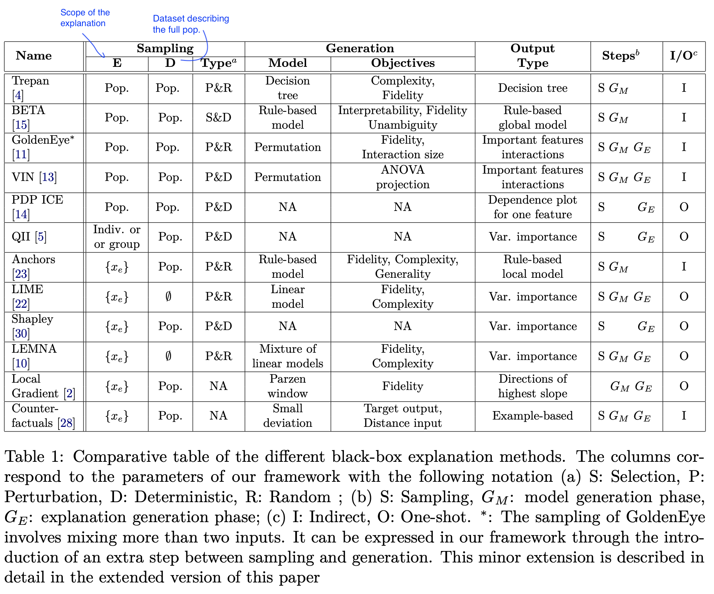
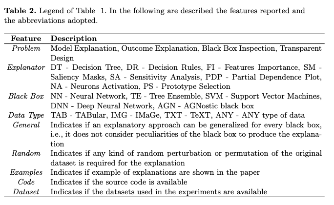
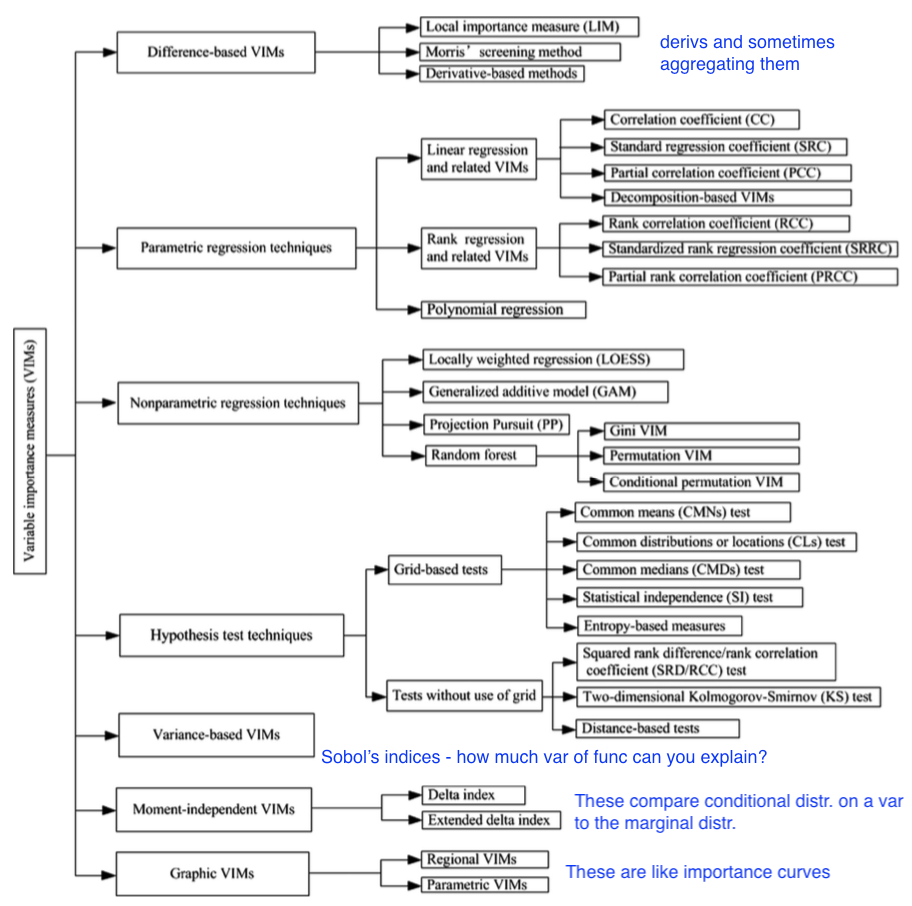

**some papers I like involving interpretable machine learning, largely organized based on this [interpretable ml review](https://arxiv.org/abs/1901.04592), and some notes from this [interpretable ml book](https://christophm.github.io/interpretable-ml-book/)**

[TOC]

# reviews

- [Interpretable machine learning: definitions, methods, and applications](https://arxiv.org/abs/1901.04592) (murdoch et al. 2019)
- [Predictive Models: Explore, Explain, and Debug](https://pbiecek.github.io/PM_VEE/preface.html) (biecek & burzykowski, in progress)
- [Explanation Methods in Deep Learning: Users, Values, Concerns and Challenges](https://arxiv.org/abs/1803.07517) (ras et al. 2018)
- [Interpretable Deep Learning in Drug Discovery](https://arxiv.org/abs/1903.02788)
- [Explainable AI: A Brief Survey on History, Research Areas, Approaches and Challenges](https://link.springer.com/chapter/10.1007/978-3-030-32236-6_51)
- [Explainable Artificial Intelligence (XAI): Concepts, Taxonomies, Opportunities and Challenges toward Responsible AI](https://arxiv.org/abs/1910.10045)
- [Towards a Generic Framework for Black-box Explanation Methods](https://hal.inria.fr/hal-02131174v2/document) (henin & metayer 2019)
  - sampling - selection of inputs to submit to the system to be explained
  - generation - analysis of links between selected inputs and corresponding outputs to generate explanations
  
    1. *proxy* - approximates model (ex. rule list, linear model)
	  
    2. *explanation generation* - explains the proxy (ex. just give most important 2 features in rule list proxy, ex. LIME gives coefficients of linear model, Shap: sums of elements)
  - interaction (with the user)
  - this is a super useful way to think about explanations (especially local), but doesn't work for SHAP / CD which are more about how much a variable contributes rather than a local approximation

- [feature (variable) importance measurement review (VIM)](https://www.sciencedirect.com/science/article/pii/S0951832015001672) (wei et al. 2015)
  
  - often-termed sensitivity, contribution, or impact
  - some of these can be applied to data directly w/out model (e.g. correlation coefficient, rank correlation coefficient, moment-independent VIMs)
  - 
- [Machine Learning and the Future of Realism](https://arxiv.org/pdf/1704.04688.pdf) (hooker & hooker, 2017)
  - anti-realism over realism
  - lack of interpretability in NNs is part of what makes them powerful
  - *naked predictions* - numbers with no real interpretation
    - more central to science than modelling?
    - no theory needed? (Breiman 2001)
  - old school: realist studied neuroscience (Wundt), anti-realist just stimuli/response patterns (Skinner), now neither
  - interpretability properties
    - *simplicity* - too complex
    - *risk* - too complex
    - *efficiency* - basically generalizability
    - *unification* - answers *ontology* - the nature of being
    - *realism* in a partially accessible world
  - overall, they believe there is inherent value of ontological description
- [Explainable Artificial Intelligence and Machine Learning: A reality rooted perspective](https://arxiv.org/pdf/2001.09464v1.pdf) (Emmert-Streib et al. 2020)
  - explainable AI is not a new field but has been already recognized and discussed for expert systems in the 1980s
  1. in some cases, such as simple physics, we can hope to get a **theory** - however, when the underlying process is complicated, interpretation can't hope to simplify it
  2. in other cases, we might hope just for a **description**

# evaluating interp + criticisms

- [Benchmarking Attribution Methods with Relative Feature Importance](https://arxiv.org/abs/1907.09701) (yang & kim 2019)
  - train a classifier, add random stuff (like dogs) to the image, classifier should assign them little importance
- [Visualizing the Impact of Feature Attribution Baselines](https://distill.pub/2020/attribution-baselines/)
  - **top-k-ablation**: should identify top pixels, ablate them, and want it to actually decrease
  - **center-of-mass ablation**: also could identify center of mass of saliency map and blur a box around it (to avoid destroying feature correlations in the model)
  - should we be **true-to-the-model** or **true-to-the-data**?
- [Evaluating Feature Importance Estimates](https://arxiv.org/abs/1806.10758) (hooker et al. 2019)
  - **remove-and-retrain test accuracy decrease**
- [Quantifying Interpretability of Arbitrary Machine Learning Models Through Functional Decomposition](https://arxiv.org/pdf/1904.03867.pdf) (molnar 2019)
- [An Evaluation of the Human-Interpretability of Explanation](https://arxiv.org/pdf/1902.00006.pdf) (lage et al. 2019)
- [How do Humans Understand Explanations from Machine Learning Systems?: An Evaluation of the Human-Interpretability of Explanation](https://arxiv.org/pdf/1802.00682.pdf) (narayanan et al. 2018)
- [On the (In)fidelity and Sensitivity for Explanations](https://arxiv.org/abs/1901.09392)
- [Benchmarking Attribution Methods with Relative Feature Importance](https://arxiv.org/abs/1907.09701) (yang & kim 2019)
- [Do Explanations Reflect Decisions? A Machine-centric Strategy to Quantify the Performance of Explainability Algorithms](https://arxiv.org/abs/1910.07387)
- [On Validating, Repairing and Refining Heuristic ML Explanations](https://arxiv.org/abs/1907.02509)
- [How Much Can We See? A Note on Quantifying Explainability of Machine Learning Models](https://arxiv.org/abs/1910.13376)
- [Towards A Rigorous Science of Interpretable Machine Learning](https://arxiv.org/pdf/1702.08608.pdf) (doshi-velez & kim 2017)
- [Manipulating and Measuring Model Interpretability](https://arxiv.org/abs/1802.07810) (sangdeh et al. ... wallach 2019)
  - participants who were shown a clear model with a small number of features were better able to simulate the model’s predictions
  - no improvements in the degree to which participants followed the model’s predictions when it was beneficial to do so.
  - increased transparency hampered people’s ability to detect when the model makes a sizable mistake and correct for it, seemingly due to information overload
- [Towards a Framework for Validating Machine Learning Results in Medical Imaging](https://dl.acm.org/citation.cfm?id=3332193)
- [An Integrative 3C evaluation framework for Explainable Artificial Intelligence](https://aisel.aisnet.org/amcis2019/ai_semantic_for_intelligent_info_systems/ai_semantic_for_intelligent_info_systems/10/)
- [Evaluating Explanation Without Ground Truth in Interpretable Machine Learning](https://arxiv.org/pdf/1907.06831.pdf) (yang et al. 2019)
  - predictability (does the knowledge in the explanation generalize well)
  - fidelity (does explanation reflect the target system well)
  - persuasibility (does human satisfy or comprehend explanation well)

## criticisms

- [Sanity Checks for Saliency Maps](https://papers.nips.cc/paper/8160-sanity-checks-for-saliency-maps.pdf) (adebayo et al. 2018)
  - **Model Parameter Randomization Test** - attributions should be different for trained vs random model
- [Interpretable Deep Learning under Fire](https://arxiv.org/abs/1812.00891) (zhang et al. 2019)
- [How can we fool LIME and SHAP? Adversarial Attacks on Post hoc Explanation Methods](https://arxiv.org/abs/1911.02508)
  - we can build classifiers which use important features (such as race) but explanations will not reflect that
  - basically classifier is different on X which is OOD (and used by LIME and SHAP)
- [Saliency Methods for Explaining Adversarial Attacks](https://arxiv.org/abs/1908.08413)
- [Fooling Neural Network Interpretations via Adversarial Model Manipulation](https://arxiv.org/abs/1902.02041) (heo et al. 2019)

# intrinsic (during model fitting)

## interpretable dnns

- [prototypes I](https://arxiv.org/pdf/1710.04806.pdf) (li et al. 2017)
  - uses encoder/decoder setup
  - encourage every prototype to be similar to at least one encoded input
  - learned prototypes in fact look like digits
  - correct class prototypes go to correct classes
  - loss: classification + reconstruction + distance to a training point
- [prototypes II](https://arxiv.org/abs/1806.10574) (chen et al. 2018)
  - can have smaller prototypes
  - l2 distance
  - require the filters to be identical to the latent representation of some training image patch
  - cluster image patches of a particular class around the prototypes of the same class, while separating image patches of different classes
  - maxpool class prototypes so spatial size doesn't matter
  - also get heatmap of where prototype was activated (only max really matters)
  - train in 3 steps
    - train everything: classification + clustering around intraclass prototypes + separation between interclass prototypes (last layer fixed to 1s / -0.5s)
    - project prototypes to data patches
    - learn last layer
- [Concept Whitening for Interpretable Image Recognition](https://arxiv.org/pdf/2002.01650.pdf) (chen et al. 2020) - force network to separate "concepts" (like in TCAV) along different axes
- [Towards Explainable Deep Neural Networks (xDNN)](https://arxiv.org/abs/1912.02523) (angelov & soares 2019) - more complex versionf of using prototypes
- [MonoNet: Towards Interpretable Models by Learning Monotonic Features](https://arxiv.org/abs/1909.13611) - enforce output to be a monotonic function of individuaul features
- [Interpretability Beyond Classification Output: Semantic Bottleneck Networks](https://arxiv.org/abs/1907.10882) - add an interpretable intermediate bottleneck representation
- [Improved Deep Fuzzy Clustering for Accurate and Interpretable Classifiers](https://ieeexplore.ieee.org/abstract/document/8858809) - extract features with a DNN then do fuzzy clustering on this
- [Approximating CNNs with Bag-of-local-Features models works surprisingly well on ImageNet](https://arxiv.org/abs/1904.00760)
  - [learn shapes not texture](https://openreview.net/pdf?id=Bygh9j09KX)
  - [code](https://github.com/wielandbrendel/bag-of-local-features-models)
- [Towards Robust Interpretability with Self-Explaining Neural Networks](https://arxiv.org/pdf/1806.07538.pdf) (alvarez-melis & jaakkola 2018) - building architectures that explain their predictions
- [Harnessing Deep Neural Networks with Logic Rules](https://arxiv.org/pdf/1603.06318.pdf)
- [Tensor networks](https://www.perimeterinstitute.ca/research/research-initiatives/tensor-networks-initiative) - like DNN that only takes boolean inputs and deals with interactions explicitly

## trees

- [Building more accurate decision trees with the additive tree](https://www.pnas.org/content/116/40/19887) (luna et al. 2019)
  - present additive tree (AddTree), which builds a single decision tree, which is between a single CART tree and boosted decision stumps
  - cart can be seen as a boosting algorithm on stumps
    - can rewrite boosted stumps as a tree very easily
    - previous work: can grow tree based on Adaboost idea = AdaTree
  - 

## rule lists / sets

- these algorithms usually don't support regression, but you can get regression by cutting the outcome into intervals
- oneR algorithm - select feature that carries most information about the outcome and then split multiple times on that feature
- sequential covering - keep trying to cover more points sequentially
- people are frequently trying to extract rules from trained dnns
- [foundations of rule learning](https://dl.acm.org/citation.cfm?id=2788240) (furnkranz et al. 2014)
  - 2 basic concepts for a rule
    - converage = support
    - accuracy = confidence = consistency
      - measures for rules: precision, info gain, correlation, m-estimate, Laplace estimate
- [interpretable classifiers using rules and bayesian analysis](https://projecteuclid.org/download/pdfview_1/euclid.aoas/1446488742) (letham et al. 2015)
  - start by mining rules (want them to apply to a large amount of data and not have too many conditions) - uses FP-Growth algorithm (borgelt 2005), could also uses Apriori or Eclat
    - current approach does not allow for negation (e.g. not diabetes) and must split continuous variables into categorical somehow (e.g. quartiles)
    - mines things that frequently occur together, but doesn't look at outcomes in this step - okay (since this is all about finding rules with high support)
  - learn rules w/ prior for short rule conditions and short lists
    - start w/ random list 
    - sample new lists by adding/removing/moving a rule
    - at the end, return the list that had the highest probability
  - [scalable bayesian rule lists](https://dl.acm.org/citation.cfm?id=3306086) (yang et al. 2017) - faster algorithm for computing
- [learning certifiably optimal rules lists](https://dl.acm.org/citation.cfm?id=3098047) (angelino et al. 2017) - optimization for categorical feature space
  - can get upper / lower bounds for loss = risk + $\lambda$ * listLength
- [interpretable decision set](https://dl.acm.org/citation.cfm?id=2939874) (lakkaraju et al. 2016) - set of if then rules which are all independent (not falling)
- [A Bayesian Framework for Learning Rule Sets for Interpretable Classification](http://www.jmlr.org/papers/volume18/16-003/16-003.pdf) (wang et al. 2017) - rules are a bunch of clauses OR'd together (e.g. if (X1>0 AND X2<1) OR (X2<1 AND X3>1) OR ... then Y=1)
- [optimal sparse decision trees](https://arxiv.org/abs/1904.12847) (hu et al. 2019) - optimal decision trees for binary variables
- [2helps2b paper](https://www.ncbi.nlm.nih.gov/pubmed/29052706)
  - 
- [Expert-augmented machine learning](https://arxiv.org/abs/1903.09731) (gennatas et al. 2019)
  - make rule lists, then compare the outcomes for each rule with what clinicians think should be outcome for each rule
    - look at rules with biggest disagreement and engineer/improve rules or penalize unreliable rules

## misc models

- learning AND-OR Templates for Object Recognition and Detection (zhu_13)
- ross et al. - constraing model during training
- scat transform idea (mallat_16 rvw, oyallan_17)
- force interpretable description by piping through something interpretable (ex. tenenbaum scene de-rendering)
- learn concepts through probabilistic program induction
- force biphysically plausible learning rules
- [The Convolutional Tsetlin Machine](https://arxiv.org/pdf/1905.09688.pdf) - uses easy-to-interpret conjunctive clauses
  - [The Tsetlin Machine](https://arxiv.org/pdf/1804.01508.pdf)
- [Making Bayesian Predictive Models Interpretable: A Decision Theoretic Approach](https://arxiv.org/abs/1910.09358)
- [Case-Based Reasoning for Assisting Domain Experts in Processing Fraud Alerts of Black-Box Machine Learning Models](https://arxiv.org/abs/1907.03334)
- [Beyond Sparsity: Tree Regularization of Deep Models for Interpretability](https://arxiv.org/pdf/1711.06178.pdf)
  - regularize so that deep model can be closely modeled by tree w/ few nodes

## gams + symbolic regression

- [Building and Evaluating Interpretable Models using Symbolic Regression and Generalized Additive Models](https://openreview.net/pdf?id=BkgyvQzmW)
  - gams - assume model form is additive combination of some funcs, then solve via GD
  - however, if we don't know the form of the model we must generate it
- [Bridging the Gap: Providing Post-Hoc Symbolic Explanations for Sequential Decision-Making Problems with Black Box Simulators](https://arxiv.org/abs/2002.01080)

## programs

- **program synthesis** - automatically find a program in an underlying programming language that satisfies some user intent
  - **ex. program induction** - given a dataset consisting of input/output pairs, generate a (simple?) program that produces the same pairs
- [probabilistic programming](https://en.wikipedia.org/wiki/Probabilistic_programming) - specify graphical models via a programming language

# posthoc (after model fitting)

## model-agnostic methods

- local surrogate ([LIME](https://arxiv.org/abs/1602.04938)) - fit a simple model locally to on point and interpret that
   - select data perturbations and get new predictions
     - for tabular data, this is just varying the values around the prediction
     - for images, this is turning superpixels on/off
     - superpixels determined in unsupervised way
   - weight the new samples based on their proximity
   - train a kernel-weighted, interpretable model on these points
   - LEMNA - like lime but uses lasso + small changes
- [anchors](https://www.aaai.org/ocs/index.php/AAAI/AAAI18/paper/view/16982/15850) (ribeiro et al. 2018) - find biggest square region of input space that contains input and preserves same output (with high precision)
   1. does this search via iterative rules
- [What made you do this? Understanding black-box decisions with sufficient input subsets](https://arxiv.org/pdf/1810.03805.pdf)
   - want to find smallest subsets of features which can produce the prediction
     - other features are masked or imputed
- [VIN](http://citeseerx.ist.psu.edu/viewdoc/download?doi=10.1.1.91.7500&rep=rep1&type=pdf) (hooker 04) - variable interaction networks - globel explanation based on detecting additive structure in a black-box, based on ANOVA
- [local-gradient](http://www.jmlr.org/papers/v11/baehrens10a.html) (bahrens et al. 2010) - direction of highest slope towards a particular class / other class
- [golden eye](https://idp.springer.com/authorize/casa?redirect_uri=https://link.springer.com/article/10.1007/s10618-014-0368-8&casa_token=AhKnW6Xx4L0AAAAA:-SEMsMjDX3_rU5gyGx6plcmF5A_ufXvsWJHzjCUIGWHGW0fqOe50yhWKYOK6UIPDHQaUwEkE3RK17XOByzo) (henelius et al. 2014) - randomize different groups of features and search for groups which interact
- **[shapley value](http://papers.nips.cc/paper/7062-a-unified-approach-to-interpreting-model-predicti)** - average marginal contribution of a feature value across all possible sets of feature values
  - "how much does prediction change on average when this feature is added?"
  - tells us the difference between the actual prediction and the average prediction
  - estimating: all possible sets of feature values have to be evaluated with and without the j-th feature
    - this includes sets of different sizes
    - to evaluate, take expectation over all the other variables, fixing this variables value
  - shapley sampling value - sample instead of exactly computing
    - quantitative input influence is similar to this...
  - satisfies 3 properties
      - local accuracy - basically, explanation scores sum to original prediction
      - missingness - features with $x'_i=0$ have 0 impact
      - consistency - if a model changes so that some simplified input’s contribution increases or stays the same regardless of the other inputs, that input’s attribution should not decrease.
  - interpretation: Given the current set of feature values, the contribution of a feature value to the
    difference between the actual prediction and the mean prediction is the estimated Shapley value.
  - recalculate via sampling other features in expectation
  - followup [propagating shapley values](https://arxiv.org/pdf/1911.11888.pdf) (chen, lundberg, & lee 2019) - can work with stacks of different models

- [Explaining individual predictions when features are dependent: More accurate approximations to Shapley values](https://arxiv.org/abs/1903.10464) (aas et al. 2019) - tries to more accurately compute conditional expectation
- [Feature relevance quantification in explainable AI: A causal problem](https://arxiv.org/abs/1910.13413) (janzing et al. 2019) - argues we should just use unconditional expectation

- [quantitative input influence](https://ieeexplore.ieee.org/abstract/document/7546525) - similar to shap but more general
- permutation importance - increase in the prediction error after we permuted the feature's values
  - $\mathbb E[Y] - \mathbb E[Y|X_{\sim i}]$
  - If features are correlated, the permutation feature importance can be biased by unrealistic data
  instances (PDP problem)
  - not the same as model variance
  - Adding a correlated feature can decrease the importance of the associated feature
- [L2X: information-theoretical local approximation](https://arxiv.org/pdf/1802.07814.pdf) (chen et al. 2018) - locally assign feature importance based on mutual information with function
- [Learning Explainable Models Using Attribution Priors + Expected Gradients](https://arxiv.org/abs/1906.10670) - like doing integrated gradients in many directions (e.g. by using other points in the training batch as the baseline)
    - can use this prior to help improve performance
- [Variable Importance Clouds: A Way to Explore Variable Importance for the Set of Good Models](https://arxiv.org/pdf/1901.03209.pdf) 
- [All Models are Wrong, but Many are Useful: Learning a Variable's Importance by Studying an Entire Class of Prediction Models Simultaneously](https://arxiv.org/abs/1801.01489) (Aaron, Rudin, & Dominici 2018)
- [Interpreting Black Box Models via Hypothesis Testing](https://arxiv.org/abs/1904.00045)

### feature interactions
- *note: interactions depends on scale (e.g. $y= a \cdot b$, $\log y = \log a + \log b$)*
- build-up = context-free, less faithful: score is contribution of only variable of interest ignoring other variables
- break-down = occlusion = context-dependent, more faithful: score is contribution of variable of interest given all other variables (e.g. permutation test - randomize var of interest from right distr.)
- *H-statistic*: 0 for no interaction, 1 for complete interaction
  - how much of the variance of the output of the joint partial dependence is explained by the interaction instead of the individuals
  - $H^2_{jk} = \underbrace{\sum_i [\overbrace{PD(x_j^{(i)}, x_k^{(i)})}^{\text{interaction}} \overbrace{- PD(x_j^{(i)}) - PD(x_k^{(i)})}^{\text{individual}}]^2}_{\text{sum over data points}} \: / \: \underbrace{\sum_i [PD(x_j^{(i)}, x_k^{(i)})}_{\text{normalization}}]^2$
  - alternatively, using ANOVA decomp: $H_{jk}^2 = \sum_i g_{ij}^2 / \sum_i (\mathbb E [Y|X_i, X_j])^2$
  - same assumptions as PDP: features need to be independent
- alternatives
  - variable interaction networks (Hooker, 2004) - decompose pred into main effects + feature interactions
  - PDP-based feature interaction (greenwell et al. 2018)
- feature-screening (feng ruan's work)
  - want to find beta which is positive when a variable is important
  - idea: maximize difference between (distances for interclass) and (distances for intraclass)
  - using an L1 distance yields better gradients than an L2 distance

### vim framework

- vim definition
        1. a quantitative indicator that quantifies the change of model output value w.r.t. the change or permutation of one or a set of input variables
        2. an indicator that quantifies the contribution of the uncertainties of one or a set of input variables to the uncertainty of model output variable
        3. an indicator that quantifies the strength of dependence between the model output variable and one or a set of input variables. 
  
  - difference-based - deriv=based methods, local importance measure, morris' screening method
    - **LIM** (local importance measure) - like LIME
      - can normalize weights by values of x, y, or ratios of their standard deviations
      - can also decompose variance to get the covariances between different variables
      - can approximate derivative via adjoint method or smth else
    - **morris' screening method**
      - take a grid of local derivs and look at the mean / std of these derivs
      - can't distinguish between nonlinearity / interaction
    - using the squared derivative allows for a close connection w/ sobol's total effect index
      - can extend this to taking derivs wrt different combinations of variables
  - parametric regression
    - correlation coefficient, linear reg coeffeicients
    - **partial correlation coefficient** (PCC) - wipe out correlations due to other variables
      - do a linear regression using the other variables (on both X and Y) and then look only at the residuals
    - rank regression coefficient - better at capturing nonlinearity
    - could also do polynomial regression
    - more techniques (e.g. relative importance analysis RIA)

      - nonparametric regression
        - use something like LOESS, GAM, projection pursuit
        - rank variables by doing greedy search (add one var at a time) and seeing which explains the most variance

  - hypothesis test
    - **grid-based hypothesis tests**: splitting the sample space (X, Y) into grids and then testing whether the patterns of sample distributions across different grid cells are random
      - ex. see if means vary
      - ex. look at entropy reduction
    - other hypothesis tests include the squared rank difference, 2D kolmogorov-smirnov test, and distance-based tests
  - variance-based vim (sobol's indices)
    - **ANOVA decomposition** - decompose model into conditional expectations $Y = g_0 + \sum_i g_i (X_i) + \sum_i \sum_{j > i} g_{ij} (X_i, X_j) + \dots + g_{1,2,..., p}$
      - $g_0 = \mathbf E (Y)\\ g_i = \mathbf E(Y|X_i) - g_0 \\ g_{ij} = \mathbf E (Y|X_i, X_j) - g_i - g_j - g_0\\...$
      - take variances of these terms
      - if there are correlations between variables some of these terms can misbehave
      - note: $V(Y) = \sum_i V (g_i) + \sum_i \sum_{j > i} V(g_{ij}) + ... V(g_{1,2,...,p})$ - variances are orthogonal and all sum to total variance
    - $S_i$: **Sobol’s main effect** index: $=V(g_i)=V(E(Y|X_i))=V(Y)-E(V(Y|X_i))$
      - small value indicates $X_i$ is non-influential
      - usually used to select important variables
    - $S_{Ti}$: **Sobol's total effect** index - include all terms (even interactions) involving a variable
  - equivalently, $V(Y) - V(E[Y|X_{\sim i}])$
    - usually used to screen unimportant variables
      - it is common to normalize these indices by the total variance $V(Y)$
    - three methods for computation - Fourire amplitude sensitivity test, meta-model, MCMC
    - when features are correlated, these can be strange (often inflating the main effects)
      - can consider $X_i^{\text{Correlated}} = E(X_i|X_{\sim i})$ and $X_i^{\text{Uncorrelated}} = X_i - X_i^{\text{Correlated}}$
  - this can help us understand the contributions that come from different features, as well as the correlations between features (e.g. $S_i^{\text{Uncorrelated}} = V(E[Y|X_i^{\text{Uncorrelated}}])/V(Y)$
    - [sobol indices connected to shapley value](https://epubs.siam.org/doi/pdf/10.1137/130936233)
      - $SHAP_i = \underset{S, i \in S}{\sum} V(g_S) / |S|$
  - moment-independent vim
    - want more than just the variance ot the output variables
    - e.g. **delta index** = average dist. between $f_Y(y)$ and $f_{Y|X_i}(y)$ when $X_i$ is fixed over its full distr.
      - $\delta_i = \frac 1 2 \mathbb E \int |f_Y(y) - f_{Y|X_i} (y) | dy = \frac 1 2 \int \int |f_{Y, X_i}(y, x_i) - f_Y(y) f_{X_i}(x_i)|dy \,dx_i$
      - moment-independent because it depends on the density, not just any moment (like measure of dependence between $y$ and $X_i$
    - can also look at KL, max dist..
  - graphic vim - like curves
    - e.g. scatter plot, meta-model plot, regional VIMs, parametric VIMs
    - CSM - relative change of model ouput mean when range of $X_i$ is reduced to any subregion
    - CSV - same thing for variance
- [anova decomposition](https://statweb.stanford.edu/~owen/mc/A-anova.pdf) - factor function into means, first-order terms, and interaction terms

## model-agnostic curves

- **pdp plots** - marginals (force value of plotted var to be what you want it to be)
- separate into **ice plots**  - marginals for instance

  - average of ice plots = pdp plot
  - sometimes these are centered, sometimes look at derivative
- both pdp ice suffer from many points possibly not being real
- possible solution: **Marginal plots M-plots** (bad name - uses conditional, not marginal)

  - only use points conditioned on certain variable
  - problem: this bakes things in (e.g. if two features are correlated and only one important, will say both are important)
- **ALE-plots** - take points conditioned on value of interest, then look at differences in predictions around a window

  - this gives pure effect of that var and not the others
  - needs an order (i.e. might not work for caterogical)
  - doesn't give you individual curves
  - recommended very highly by the book...
  - they integrate as you go...
- summary: To summarize how each type of plot (PDP, M, ALE) calculates the effect of a feature at a certain grid value v:
   - Partial Dependence Plots: “Let me show you what the model predicts on average when each data instance has the value v for that feature. I ignore whether the value v makes sense for all data instances.” 
- M-Plots: “Let me show you what the model predicts on average for data instances that have values close to v for that feature. The effect could be due to that feature, but also due to correlated features.” 
  - ALE plots: “Let me show you how the model predictions change in a small “window” of the feature around v for data instances in that window.” 

## tree ensembles

- MDI = Gini importance
- Breiman proposes permutation tests: Breiman, Leo. 2001. “Random Forests.” Machine Learning 45 (1). Springer: 5–32
- [Explainable AI for Trees: From Local Explanations to Global Understanding](https://arxiv.org/abs/1905.04610) (lundberg et al. 2019)
  - shap-interaction scores - distribute among pairwise interactions + local effects
  - plot lots of local interactions together - helps detect trends
  - propose doing shap directly on loss function (identify how features contribute to loss instead of prediction)
  - can run supervised clustering (where SHAP score is the label) to get meaningful clusters
    - alternatively, could do smth like CCA on the model output
- [conditional variable importance for random forests](https://bmcbioinformatics.biomedcentral.com/articles/10.1186/1471-2105-9-307) (strobl et al. 2008)
  - propose permuting conditioned on the values of variables not being permuted
    - to find region in which to permute, define the grid within which the values of $X_j$ are permuted for each tree by means of the partition of the feature space induced by that tree
  - many scores (such as MDI, MDA) measure marginal importance, not conditional importance
    - as a result, correlated variables get importances which are too high
- [treeshap](https://arxiv.org/abs/1802.03888) (lundberg, erion & lee, 2019): prediction-level
  - individual feature attribution: want to decompose prediction into sum of attributions for each feature
    - each thing can depend on all features
  - Saabas method: basic thing for tree
    - you get a pred at end
    - count up change in value at each split for each variable
  - three properties
    - local acc - decomposition is exact
    - missingness - features that are already missing are attributed no importance
      - for missing feature, just (weighted) average nodes from each split
    - consistency - if F(X) relies more on a certain feature j, $F_j(x)$ should 
      - however Sabaas method doesn't change $F_j(X)$ for $F'(x) = F(x) + x_j$
  - these 3 things iply we want shap values
  - average increase in func value when selecting i (given all subsets of other features)
  - for binary features with totally random splits, same as Saabas
  - **can cluster based on explanation similarity** (fig 4)
    - can quantitatively evaluate based on clustering of explanations
  - their fig 8 - qualitatively can see how different features alter outpu
  - gini importance is like weighting all of the orderings
- [understanding variable importances in forests of randomized trees](http://papers.nips.cc/paper/4928-understanding-variable-importances-in-forests-of-randomized-tre) (louppe et al. 2013)
  - consider fully randomized trees
    - assume all categorical
    - randomly pick feature at each depth, split on all possibilities
    - also studied by biau 2012
    - extreme case of random forest w/ binary vars?
  - real trees are harder: correlated vars and stuff mask results of other vars lower down
  - asymptotically, randomized trees might actually be better
- [Actionable Interpretability through Optimizable Counterfactual Explanations for Tree Ensembles](https://arxiv.org/pdf/1911.12199v1.pdf) (lucic et al. 2019)

## example-based explanations

- influential instances - want to find important data points
- deletion diagnostics - delete a point and see how much it changed

- [influence funcs](https://arxiv.org/abs/1703.04730) (koh & liang, 2017): use **Hessian** ($\theta x \theta$) to give effect of upweighting a point
  - influence functions = inifinitesimal approach - upweight one person by infinitesimally small weight and see how much estimate changes (e.g. calculate first derivative)
  - influential instance - when data point removed, has a strong effect on the model (not necessarily same as an outlier)
  - requires access to gradient (e.g. nn, logistic regression)
  - take single step with Newton's method after upweighting loss

  - yield change in parameters by removing one point
  - yield change in loss at one point by removing a different point (by multiplying above by cahin rule)
  - yield change in parameters by modifying one point

## textual explanations

- lisa hendricks + trevor darrell
- [Adversarial Inference for Multi-Sentence Video Description](https://arxiv.org/pdf/1812.05634.pdf) - adversarial techniques during inference for a better multi-sentence video description
- [Object Hallucination in Image Captioning](https://aclweb.org/anthology/D18-1437) - image relevance metric - asses rate of object hallucination
   - CHAIR metric - what proportion of words generated are actually in the image according to gt sentences and object segmentations
- [women also snowboard](https://arxiv.org/pdf/1803.09797.pdf) - force caption models to look at people when making gender-specific predictions
- [Fooling Vision and Language Models Despite Localization and Attention Mechanism](http://openaccess.thecvf.com/content_cvpr_2018/papers/Xu_Fooling_Vision_and_CVPR_2018_paper.pdf) -  can do adversarial attacks on captioning and VQA
- [Grounding of Textual Phrases in Images by Reconstruction](https://arxiv.org/pdf/1511.03745.pdf) - given text and image provide a bounding box (supervised problem w/ attention)
- [Natural Language Explanations of Classifier Behavior](https://ieeexplore.ieee.org/abstract/document/8791710)

## dnn visualization

- [good summary on distill](https://distill.pub/2017/feature-visualization/)
- **visualize intermediate features**
    1. visualize filters by layer
      - doesn't really work past layer 1
    2. *decoded filter* - rafegas & vanrell 2016
      - project filter weights into the image space
      - pooling layers make this harder
    3. *deep visualization* - yosinski 15
    4. [Understanding Deep Image Representations by Inverting Them](https://arxiv.org/abs/1412.0035) (mahendran & vedaldi 2014) - generate image given representation
- penalizing activations
    - [interpretable cnns](http://openaccess.thecvf.com/content_cvpr_2018/CameraReady/0490.pdf) (zhang et al. 2018) - penalize activations to make filters slightly more intepretable
      - could also just use specific filters for specific classes...
    - teaching compositionality to cnns - mask features by objects
- **maximal activation stuff**
    1. images that maximally activate a feature 
      - [deconv nets](https://arxiv.org/pdf/1311.2901.pdf) - Zeiler & Fergus (2014)
        - use deconvnets (zeiler et al. 2011) to map features back to pixel space
        - given one image, get the activations (e.g. maxpool indices) and use these to get back to pixel space
        - everything else does not depend on the original image
        - might want to use optimization to generate image that makes optimal feature instead of picking from training set
      - before this, erhan et al. did this for unsupervised features
      - dosovitskiy et al 16 - train generative deconv net to create images from neuron activations
        - aubry & russel 15 do similar thing
    2. [deep dream](https://research.googleblog.com/2015/06/inceptionism-going-deeper-into-neural.html) - reconstruct image from feature map
      - could use natural image prior
      - could train deconvolutional NN
      - also called *deep neuronal tuning* - GD to find image that optimally excites filters
    3. define *neuron feature* - weighted average version of a set of maximum activation images that capture essential properties - rafegas_17
      - can also define *color selectivity index* - angle between first PC of color distribution of NF and intensity axis of opponent color space
      - *class selectivity index* - derived from classes of images that make NF
    4. saliency maps for each image / class
      - simonyan et al 2014
    5. [Diagnostic Visualization for Deep Neural Networks Using Stochastic Gradient Langevin Dynamics](https://arxiv.org/pdf/1812.04604.pdf) - sample deep dream images generated by gan
- [posthoc prototypes](https://openreview.net/forum?id=r1xyx3R9tQ)
    - **counterfactual explanations** - like adversarial, counterfactual explanation describes smallest change to feature vals that changes the prediction to a predefined output
      - maybe change fewest number of variables not their values
      - counterfactual should be reasonable (have likely feature values)
      - human-friendly
      - usually multiple possible counterfactuals (Rashomon effect)
      - can use optimization to generate counterfactual
      - **anchors** - opposite of counterfactuals, once we have these other things won't change the prediction
    - prototypes (assumed to be data instances)
      - prototype = data instance that is representative of lots of points
      - criticism = data instances that is not well represented by the set of prototypes
      - examples: k-medoids or MMD-critic
        - selects prototypes that minimize the discrepancy between the data + prototype distributions
- [concept activation vectors](https://arxiv.org/abs/1711.11279)
    - Given: a user-defined set of examples for a concept (e.g., ‘striped’), and random
            examples, labeled training-data examples for the studied class (zebras) 
        - given trained network
        - TCAV can quantify the model’s sensitivity to the concept for that class. CAVs are learned by training a linear classifier to distinguish between the activations produced by
            a concept’s examples and examples in any layer
        - CAV - vector orthogonal to the classification boundary
        - TCAV uses the derivative of the CAV direction wrt input
    - [automated concept activation vectors](https://arxiv.org/abs/1902.03129) - Given a set of concept discovery images, each image is segmented with different resolutions to find concepts that are captured best at different sizes. (b) After removing duplicate segments, each segment is resized tothe original input size resulting in a pool of resized segments of the discovery images. (c) Resized segments are mapped to a model’s activation space at a bottleneck layer. To discover the concepts associated with the target class, clustering with outlier removal is performed. (d) The output of our method is a set of discovered concepts for each class, sorted by their importance in prediction
- [On Concept-Based Explanations in Deep Neural Networks](https://arxiv.org/abs/1910.07969)
- [Explanation by Progressive Exaggeration](https://arxiv.org/abs/1911.00483)
- [Explaining Deep Learning Models with Constrained Adversarial Examples](https://arxiv.org/abs/1906.10671)
- [Understanding Deep Architectures by Visual Summaries](http://bmvc2018.org/papers/0794.pdf)
- [Semantics for Global and Local Interpretation of Deep Neural Networks](https://arxiv.org/abs/1910.09085)
- [Iterative augmentation of visual evidence for weakly-supervised lesion localization in deep interpretability frameworks](https://arxiv.org/abs/1910.07373)
- [explaining image classifiers by counterfactual generation](https://arxiv.org/pdf/1807.08024.pdf) 

    - generate changes (e.g. with GAN in-filling) and see if pred actually changes
    - can search for smallest sufficient region and smallest destructive region
    - 

## dnn feature importance

- saliency maps
    1. occluding parts of the image
      - sweep over image and remove patches
      - which patch removals had highest impact on change in class?
    2. text usually uses attention maps
      - ex. karpathy et al LSTMs
      - ex. lei et al. - most relevant sentences in sentiment prediction
    3. class-activation map - sum the activations across channels (weighted by their weight for a particular class)
    4. [RISE](https://arxiv.org/pdf/1806.07421.pdf) (Petsiuk et al. 2018) - randomized input sampling
       1. randomly mask the images, get prediction
       2. saliency map = sum of masks weighted by the produced predictions
- gradient-based methods - visualize what in image would change class label
  - gradient * input
  - [integrated gradients](http://proceedings.mlr.press/v70/sundararajan17a/sundararajan17a.pdf) (sundararajan et al. 2017) - just sum up the gradients from some baseline to the image (in 1d, this is just $f(x) - f(baseline))$
    - in higher dimensions, such as images, we pick the path to integrate by starting at some baseline (e.g. all zero) and then get gradients as we interpolate between the zero image and the real image
    - if we picture 2 features, we can see that integrating the gradients will not just yield $f(x) - f(baseline)$, because each time we evaluate the gradient we change both features
    - [explanation distill article](https://distill.pub/2020/attribution-baselines/) 
      - ex. any pixels which are same in original image and modified image will be given 0 importance
      - lots of different possible choices for baseline (e.g. random Gaussian image, blurred image, random image from the training set)
      - could also average over distributions of baseline (this yields **expected gradients**)
      - when we do a Gaussian distr., this is very similar to smoothgrad
  - lrp
  - taylor decomposition
  - deeplift
  - guided backpropagation - springenberg et al
  - lets you better create maximally specific image
  - selvaraju 17 - *grad-CAM*
  - [grad-cam++](https://arxiv.org/abs/1710.11063)
  - [competitive gradients](https://arxiv.org/pdf/1905.12152.pdf) (gupta & arora 2019)
  - Label  "wins" a pixel if either (a) its map assigns that pixel a positive score higher than the scores assigned by every other label ora negative score lower than the scores assigned by every other label. 
  - final saliency map consists of scores assigned by the chosen label to each pixel it won, with the map containing a score 0 for any pixel it did not win.
  - can be applied to any method which satisfies completeness (sum of pixel scores is exactly the logit value)
- newer methods
    - [Score-CAM:Improved Visual Explanations Via Score-Weighted Class Activation Mapping](https://arxiv.org/abs/1910.01279)
    - [Removing input features via a generative model to explain their attributions to classifier's decisions](https://arxiv.org/abs/1910.04256)
    - [NeuroMask: Explaining Predictions of Deep Neural Networks through Mask Learning](https://ieeexplore.ieee.org/abstract/document/8784063)
    - [Interpreting Undesirable Pixels for Image Classification on Black-Box Models](https://arxiv.org/abs/1909.12446)
    - [Guideline-Based Additive Explanation for Computer-Aided Diagnosis of Lung Nodules](https://link.springer.com/chapter/10.1007/978-3-030-33850-3_5)
    - [Learning how to explain neural networks: PatternNet and PatternAttribution](https://arxiv.org/abs/1705.05598) - still gradient-based
        - [Generalized PatternAttribution for Neural Networks with Sigmoid Activations](https://ieeexplore.ieee.org/abstract/document/8851761)
    - [Learning Reliable Visual Saliency for Model Explanations](https://ieeexplore.ieee.org/abstract/document/8884184)
    - [Neural Network Attributions: A Causal Perspective](https://arxiv.org/abs/1902.02302)
    - [Gradient Weighted Superpixels for Interpretability in CNNs](https://arxiv.org/abs/1908.08997)
    - [Decision Explanation and Feature Importance for Invertible Networks](https://arxiv.org/abs/1910.00406) (mundhenk et al. 2019)
    - [Efficient Saliency Maps for Explainable AI](https://deepai.org/publication/efficient-saliency-maps-for-explainable-ai) 
- interactions
    - [hierarchical interpretations for neural network predictions](https://arxiv.org/abs/1806.05337) (singh et al. 2019)
      - [contextual decomposition](https://arxiv.org/abs/1801.05453) (murdoch et al. 2018)
      - ACD followup work
        - [Towards Hierarchical Importance Attribution: Explaining Compositional Semantics for Neural Sequence Models](https://openreview.net/forum?id=BkxRRkSKwr)
    - [Detecting Statistical Interactions from Neural Network Weights](https://arxiv.org/abs/1705.04977) - interacting inputs must follow strongly weighted connections to a common hidden unit before the final output
      - [Neural interaction transparency (NIT)](https://dl.acm.org/citation.cfm?id=3327482) (tsang et al. 2017)
    - [Recovering Pairwise Interactions Using Neural Networks](https://arxiv.org/pdf/1901.08361.pdf)

## improving models

- [Interpretations are useful: penalizing explanations to align neural networks with prior knowledge](https://arxiv.org/abs/1909.13584)
- [Right for the Right Reasons: Training Differentiable Models by Constraining their Explanations](https://arxiv.org/abs/1703.03717)
- [Explain to Fix: A Framework to Interpret and Correct DNN Object Detector Predictions](https://arxiv.org/pdf/1811.08011.pdf)
- [Understanding Misclassifications by Attributes](https://arxiv.org/abs/1910.07416)

## model summarization / distillation

- [piecewise linear interp](https://arxiv.org/pdf/1806.10270.pdf)
- [Computing Linear Restrictions of Neural Networks](https://arxiv.org/abs/1908.06214) - calculate function of neural network restricting its points to lie on a line
- [Interpreting CNN Knowledge via an Explanatory Graph](https://arxiv.org/abs/1708.01785) (zhang et al. 2017) - create a graph that responds better to things like objects than individual neurons
- model distillation (model-agnostic)
  - Trepan - approximate model w/ a decision tree
  - [BETA](https://arxiv.org/abs/1707.01154) (lakkaraju et al. 2017) - approximate model by a rule list
- [Distilling a Neural Network Into a Soft Decision Tree](https://arxiv.org/pdf/1711.09784.pdf) (frosst & hinton 2017)

## interp for rl

- heatmaps
- visualize most interesting states / rollouts
- language explanations
- interpretable intermediate representations (e.g. bounding boxes for autonomous driving)
- policy extraction - distill a simple model from a bigger model (e.g. neural net -> tree)

# related concepts

## trust scores / uncertainty

*papers using embeddings to generate confidences*

- [To Trust Or Not To Trust A Classifier](http://papers.nips.cc/paper/7798-to-trust-or-not-to-trust-a-classifier.pdf) (jiang et al - trust score uses density over some set of nearest neighbors (do clustering for each class - trust score = distance to once class's cluster vs the other classes')
  - [papernot knn](https://arxiv.org/abs/1803.04765)
  - [distance-based confidence scores](https://arxiv.org/pdf/1709.09844.pdf)
  - [deep kernel knn](https://arxiv.org/pdf/1811.02579.pdf)
  - fair paper: gradients should be larger if you are on the image manifold
- calibration
    - **platt scaling** - given trained classifier and new calibration dataset, basically just fit a logistic regression from the classifier predictions -> labels
    - **isotonic regression** - nonparametric, requires more data than platt scaling
        - piecewise-constant non-decreasing function instead of logistic regression
- [Deep k-Nearest Neighbors: Towards Confident, Interpretable and Robust Deep Learning](https://arxiv.org/pdf/1803.04765.pdf)
    - [Interpreting Neural Networks With Nearest Neighbors](https://arxiv.org/pdf/1809.02847.pdf)
- [outlier-detection](https://scikit-learn.org/stable/modules/outlier_detection.html)
    - assume data is Gaussian and fit elliptic envelop (maybe robustly) to tell when data is an outlier
    - local outlier factor (breunig et al. 2000) - score based on nearest neighbor density 
    - [isolation forest](https://ieeexplore.ieee.org/abstract/document/4781136) (liu et al. 2008) - lower average number of random splits required to isolate a sample means more outlier
    - [one-class svm](https://scikit-learn.org/stable/modules/generated/sklearn.svm.OneClassSVM.html#sklearn.svm.OneClassSVM) - estimates the support of a high-dimensional distribution using a kernel
      - 2 approaches
        - separate the data from the origin (with max margin between origin and points) (scholkopf et al. 2000)
        - find a sphere boundary around a dataset with the volume of the sphere minimized ([tax & duin 2004](https://link.springer.com/article/10.1023/B:MACH.0000008084.60811.49))
    - [detachment index](https://escholarship.org/uc/item/9d34m0wz) (kuenzel 2019) - based on random forest
      - for covariate $j$, detachment index $d^j(x) = \sum_i^n w (x, X_i) |X_i^j - x^j|$
        - $w(x, X_i) = \underbrace{1 / T\sum_{t=1}^{T}}_{\text{average over T trees}} \frac{\overbrace{1\{ X_i \in L_t(x) \}}^{\text{is }   X_i \text{ in the same leaf?}}}{\underbrace{|L_t(x)|}_{\text{num points in leaf}}}$ is $X_i$ relevant to the point $x$?
- lots of papers on confidence calibration (transforms outputs into probabilities)
- [get confidences before overfitting](https://arxiv.org/abs/1805.08206)
    - 2 popular things: max margin, entropy of last layer
    - [add an extra output for uncertainty](https://arxiv.org/abs/1810.01861)
    - [learn to predict confidences](https://arxiv.org/pdf/1802.04865.pdf)
- also methods on predict with rejection possibility

  - [contextual outlier detection](https://arxiv.org/abs/1711.10589)
  - [ensembling background](https://machinelearningmastery.com/ensemble-methods-for-deep-learning-neural-networks/)
- [How to Generate Prediction Intervals with Scikit-Learn and Python](https://towardsdatascience.com/how-to-generate-prediction-intervals-with-scikit-learn-and-python-ab3899f992ed)
  - can use quantile loss to penalize models differently
  - than can use these different models to get confidence intervals
  - [can easily do this with sklearn](https://scikit-learn.org/stable/auto_examples/ensemble/plot_gradient_boosting_quantile.html)
  - quantile loss = $\begin{cases} \alpha \cdot \Delta & \text {if} \quad \Delta > 0\\(\alpha - 1) \cdot \Delta & \text{if} \quad \Delta < 0\end{cases}$
    - $\Delta =$ actual - predicted
    - 
- [uncertainty though ensemble confidence](http://papers.nips.cc/paper/7219-simple-and-scalable-predictive-uncertainty-estimation-using-deep-ensembles)
  - predict mean and variance w/ each network then ensemble
  - also add in adversarial training
  - [snapshot ensembles](https://arxiv.org/abs/1704.00109)
- bayesian neural nets
  - [icu bayesian dnns](https://aiforsocialgood.github.io/icml2019/accepted/track1/pdfs/38_aisg_icml2019.pdf)
    - focuses on epistemic uncertainty
    - could use one model to get uncertainty and other model to predict
  - [Evaluating Scalable Bayesian Deep Learning Methods for Robust Computer Vision](https://arxiv.org/pdf/1906.01620.pdf)
    - **epistemic uncertainty** - uncertainty in the DNN model parameters
      - without good estimates of this, often get aleatoric uncertainty wrong (since $p(y|x) = \int p(y|x, \theta) p(\theta |data) d\theta$
    - **aleatoric uncertainty** -  inherent and irreducible data noise (e.g. features contradict each other)
      - this can usually be gotten by predicting a distr. $p(y|x)$ instead of a point estimate
      - ex. logistic reg. already does this
      - ex. regression - just predict mean and variance of Gaussian
- [Dropout as a Bayesian Approximation: Representing Model Uncertainty in Deep Learning](http://proceedings.mlr.press/v48/gal16.pdf)
  - dropout at test time gives you uncertainty

## fairness

- good introductory [blog](https://towardsdatascience.com/a-tutorial-on-fairness-in-machine-learning-3ff8ba1040cb)
- causes of bias
  - skewed sample
  - tainted examples
  - selectively limited features
  - sample size disparity
  - proxies of sensitive attributes
- definitions
  - **unawareness** - don't show sensitive attributes
    - flaw: other attributes can still signal for it
  - group fairness
    - **demographic parity** - mean predictions for each group should be approximately equal
      - flaw: means might not be equal
    - **equalized odds** - predictions are independent of group given label
      - equality of opportunity: $p(\hat y=1|y=1)$ is same for both groups
    - **predictive rate parity** - Y is independent of group given prediction
  - **individual fairness** - similar individuals should be treated similarly
  - **counterfactual fairness** - replace attributes w/ flipped values
- fair algorithms
  - preprocessing - remove sensitive information
  - optimization at training time - add regularization
  - postprocessing - change thresholds to impose fairness

## causal discovery

- [Visual Physics: Discovering Physical Laws from Videos](https://arxiv.org/abs/1911.11893)
  - 3 steps
    - Mask R-CNN finds bounding box of object and center of bounding box is taken to be location
    - $\beta-VAE$ compresses the trajectory to some latent repr. (while also being able to predict held-out points of the trajectory)
    - **Eureqa** package does eq. discovery on latent repr + trajectory
      - includes all basic operations, such as addition, mult., sine function
      - R-squared value measures goodness of fit
  - see also SciNet -  [Discovering physical concepts with neural networks](https://arxiv.org/abs/1807.10300) (iten et al. 2020)
  - see also the field of symbolic regression
    - genetic programming is the most pervalent method here
    - alternatives: sparse regression, dimensional function synthesis

# packages

- [iNNvestigate neural nets](https://arxiv.org/abs/1808.04260) - provides a common interface and out-of-thebox implementation
- [tensorfuzz](https://arxiv.org/abs/1807.10875) - debugging
- [ICIE 1.0: A Novel Tool for Interactive Contextual Interaction Explanations](https://link.springer.com/chapter/10.1007/978-3-030-13463-1_6)

# misc new papers

- [ConvNets and ImageNet Beyond Accuracy: Understanding Mistakes and Uncovering Biases](https://arxiv.org/abs/1711.11443)
  - cnns are more accurate, robust, and biased then we might expect on imagenet
- [Bridging Adversarial Robustness and Gradient Interpretability](https://arxiv.org/abs/1903.11626)
- [explaining a black-box w/ deep variational bottleneck](https://arxiv.org/abs/1902.06918)
- [Global Explanations of Neural Networks: Mapping the Landscape of Predictions](https://arxiv.org/abs/1902.02384)
- [neural stethoscopes](https://arxiv.org/pdf/1806.05502.pdf) 
- [xGEMs](https://arxiv.org/pdf/1806.08867.pdf) 
- [maximally invariant data perturbation](https://arxiv.org/pdf/1806.07004.pdf)
- hard coding
  - [SSIM layer](https://arxiv.org/abs/1806.09152)
  - Inverting Supervised Representations with Autoregressive Neural Density Models 
- [nonparametric var importance](http://proceedings.mlr.press/v80/feng18a/feng18a.pdf)
- [supervised local modeling](https://arxiv.org/abs/1807.02910 ) 
- [detect adversarial cnn attacks w/ feature maps](https://digitalcollection.zhaw.ch/handle/11475/8027) 
- [adaptive dropout](https://arxiv.org/abs/1807.08024)
- [lesion detection saliency](https://arxiv.org/pdf/1807.07784.pdf) 
- [How Important Is a Neuron?](https://arxiv.org/abs/1805.12233)
- [symbolic execution for dnns](https://arxiv.org/pdf/1807.10439.pdf)
- [L-shapley abd C-shapley](https://arxiv.org/pdf/1808.02610.pdf)
- [A Simple and Effective Model-Based Variable Importance Measure](https://arxiv.org/pdf/1805.04755.pdf)
  - measures the feature importance (defined as the variance of the 1D partial dependence function) of one feature conditional on different, fixed points of the other feature. When the variance is high, then the features interact with each other, if it is zero, they don’t interact.
- [Interpreting Neural Network Judgments via Minimal, Stable, and Symbolic Corrections](https://arxiv.org/pdf/1802.07384.pdf)
- [DeepPINK: reproducible feature selection in deep neural networks](https://arxiv.org/pdf/1809.01185.pdf)
- "Explaining Deep Learning Models -- A Bayesian Non-parametric Approach"
- [Detecting Potential Local Adversarial Examples for Human-Interpretable Defense](https://arxiv.org/pdf/1809.02397.pdf)
- [Interpreting Layered Neural Networks via Hierarchical Modular Representation](https://arxiv.org/pdf/1810.01588.pdf)
- [Entropic Variable Boosting for Explainability & Interpretability in Machine Learning](https://arxiv.org/abs/1810.07924)
- [Understanding Individual Decisions of CNNs via Contrastive Backpropagation](https://arxiv.org/abs/1812.02100v1)
- [Understanding Impacts of High-Order Loss Approximations and Features in Deep Learning Interpretation](https://arxiv.org/abs/1902.00407)
- [A Game Theoretic Approach to Class-wise Selective Rationalization](https://arxiv.org/abs/1910.12853)
- [Additive Explanations for Anomalies Detected from Multivariate Temporal Data](https://dl.acm.org/citation.cfm?id=3358121)
- [Asymmetric Shapley values: incorporating causal knowledge into model-agnostic explainability](https://arxiv.org/abs/1910.06358)
- [Consistent Regression using Data-Dependent Coverings](https://arxiv.org/abs/1907.02306)
- [Contextual Local Explanation for Black Box Classifiers](https://arxiv.org/abs/1910.00768)
- [Contextual Prediction Difference Analysis](https://arxiv.org/abs/1910.09086)
- [Contrastive Relevance Propagation for Interpreting Predictions by a Single-Shot Object Detector](https://ieeexplore.ieee.org/abstract/document/8851770)
- [CXPlain: Causal Explanations for Model Interpretation under Uncertainty](https://arxiv.org/abs/1910.12336)
- [Ensembles of Locally Independent Prediction Models](https://arxiv.org/abs/1911.01291)
- [Explaining Black-Box Models Using Interpretable Surrogates](https://link.springer.com/chapter/10.1007/978-3-030-29908-8_1)
- [Explaining Classifiers with Causal Concept Effect (CaCE)](https://arxiv.org/abs/1907.07165)
- [Generative Counterfactual Introspection for Explainable Deep Learning](https://arxiv.org/abs/1907.03077)
- [Grid Saliency for Context Explanations of Semantic Segmentation](https://arxiv.org/abs/1907.13054)
- [Optimal Explanations of Linear Models](https://arxiv.org/abs/1907.04669)
- [Privacy Risks of Explaining Machine Learning Models](https://arxiv.org/abs/1907.00164)
- [RL-LIM: Reinforcement Learning-based Locally Interpretable Modeling](https://arxiv.org/abs/1909.12367)
- [The many Shapley values for model explanation](https://arxiv.org/abs/1908.08474)
- [XDeep: An Interpretation Tool for Deep Neural Networks](https://arxiv.org/abs/1911.01005)
- [Shapley Decomposition of R-Squared in Machine Learning Models](https://arxiv.org/abs/1908.09718)
- [Understanding Global Feature Contributions Through Additive Importance Measures](https://arxiv.org/abs/2004.00668) (covert, lundberg, & lee 2020)
  - SAGE score looks at reduction in predictive accuracy due to subsets of features
- [Personal insights for altering decisions of tree-based ensembles over time](https://dl.acm.org/doi/abs/10.14778/3380750.3380752)
- [Gradient-Adjusted Neuron Activation Profiles for Comprehensive Introspection of Convolutional Speech Recognition Models](https://arxiv.org/abs/2002.08125)[
- [Learning Global Transparent Models from Local Contrastive Explanations](https://arxiv.org/abs/2002.08247)
- [Boosting Algorithms for Estimating Optimal Individualized Treatment Rules](https://arxiv.org/abs/2002.00079)
- [Explaining Knowledge Distillation by Quantifying the Knowledge](https://arxiv.org/abs/2003.03622)
- [Adversarial TCAV -- Robust and Effective Interpretation of Intermediate Layers in Neural Networks](https://arxiv.org/abs/2002.03549)
- [Problems with Shapley-value-based explanations as feature importance measures](https://arxiv.org/abs/2002.11097)*
- [When Explanations Lie: Why Many Modified BP Attributions Fail](https://www.researchgate.net/profile/Leon_Sixt/publication/338115768_When_Explanations_Lie_Why_Many_Modified_BP_Attributions_Fail/links/5e4e226292851c7f7f48becb/When-Explanations-Lie-Why-Many-Modified-BP-Attributions-Fail.pdf)
- [Estimating Training Data Influence by Tracking Gradient Descent](https://arxiv.org/abs/2002.08484)
- [Interpreting Interpretations: Organizing Attribution Methods by Criteria](https://arxiv.org/abs/2002.07985)
- [Explaining Groups of Points in Low-Dimensional Representations](https://arxiv.org/abs/2003.01640)
- [Causal Interpretability for Machine Learning -- Problems, Methods and Evaluation](https://arxiv.org/abs/2003.03934)
- [Cyclic Boosting - An Explainable Supervised Machine Learning Algorithm - IEEE Conference Publication](https://ieeexplore.ieee.org/abstract/document/8999347)
- [A Causality Analysis for Nonlinear Classification Model with Self-Organizing Map and Locally Approximation to Linear Model](https://www.semanticscholar.org/paper/A-Causality-Analysis-for-Nonlinear-Classification-Kirihata-Maekawa/4b76830be36ae14d878f7c0a7ff2508bfe172f64)
- [Black-Box Saliency Map Generation Using Bayesian Optimisation](https://arxiv.org/abs/2001.11366)
- [ON NETWORK SCIENCE AND MUTUAL INFORMATION FOR EXPLAINING DEEP NEURAL NETWORKS Brian Davis1∗](https://umangsbhatt.github.io/reports/icassp_2020.pdf)

