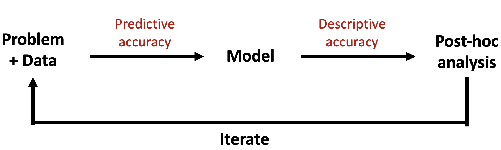
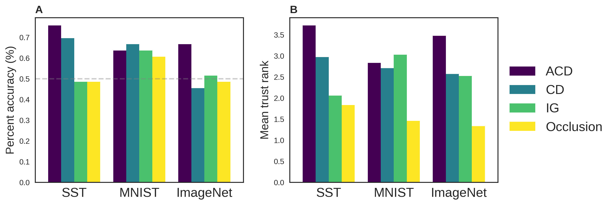
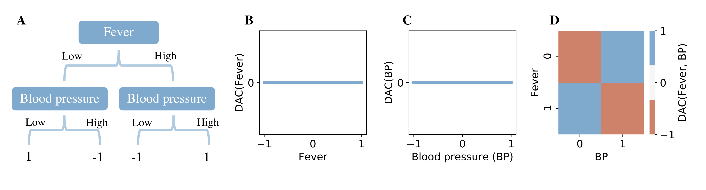
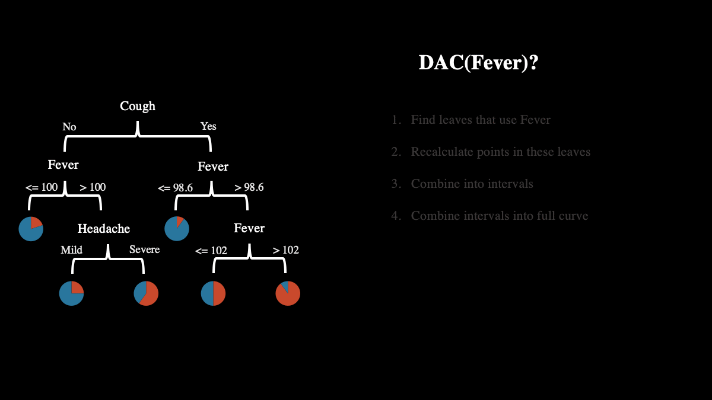
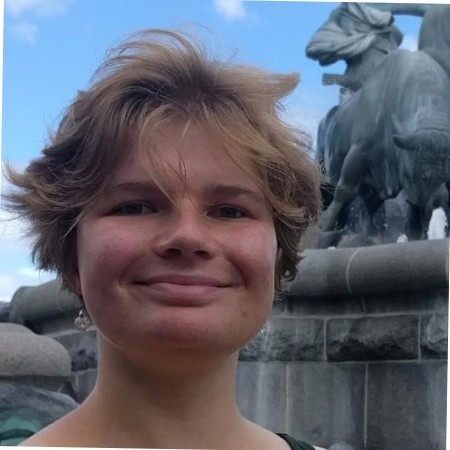
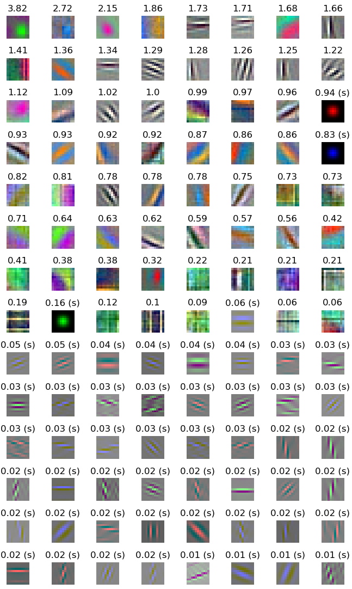
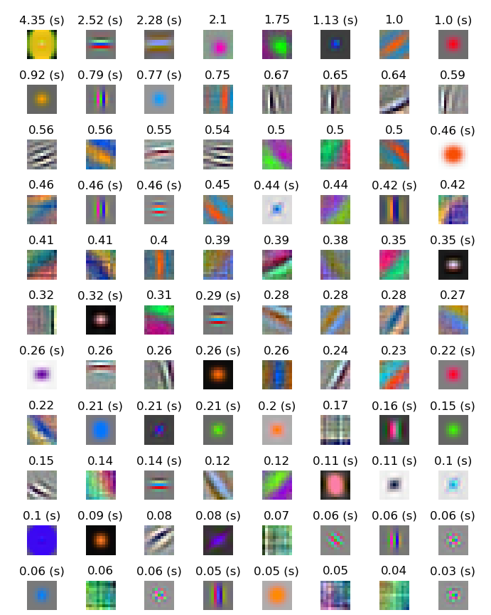

[TOC]

<h1> towards interpretable ml for neuroscience </h1>

<h3> chandan singh </h3> 

*advised by bin yu*

## requirements

- can have outside faculty
- can only have one faculty that is remote
- at least 2 eecs (0% counts e.g. bin)
- chair must be eecs
  - chair has to bring form back to division
- prepare ~45 mins of info
- total 2-3 hrs (2 hrs min) - do this

## overview

1. [interpretable ml: what's the problem](#/1)
2. [prediction-level interpretation methods](#/2)
3. [scientific applications](#/3)
4. [towards dnn theory](#/4)
5. [what's next: delving deeper into neuro](#/5)

## collaborators

<div style='float:left;width:45%;' class='centered'>
<ul>
    <li>prof. bin yu </li>
    <ul>
        <li> jamie murdoch </li>
        <li> raaz dwivedi </li>
        <li> karl kumbier </li>
        <li> summer devlin </li>
        <li> laura rieger </li>
        <li> christopher lu </li>
        <li> yu wang </li>
        <li> reza abbasi-asl </li>
    </ul>
</ul>  
</div>
<div style='float:right;width:45%;'>  
<ul>
    <li>prof. jack gallant </li>
    <ul>
        <li> michael eickenberg </li>
        <li> michael oliver </li>
    </ul>
</ul>  


<ul>
    <li>prof. gang-yu liu </li>
    <ul>
        <li> jiali (lillian) zhang </li>
    </ul>
    <li>prof. martin wainwright </li>
</ul> 

</div>

# interpretable ml: what is it?

with *jamie murdoch, karl kumbier, reza abbasi-asl, & bin yu*

   

*submitted to PNAS*

## ml is powerful

- strong predictive performance
- part of the power is the surge in big data (e.g. calcium imaging)
- often perceived as black-box: need interpretability

## defining interpretable ml

"the use of machine learning models for the extraction of *relevant* knowledge about domain relationships contained in data"

*relevant* = provides insight for a particular audience into a chosen problem

## interpretable ml framework




# explaining **single** dnn predictions

*with jamie murdoch & bin yu*

 

*published in ICLR 2019*

## the goal


## previous work

- gradient-based methods (e.g. LRP)
- perturbation-based (e.g. LIME)
- CD (for LSTMS)

## cd for cnns

<!---->

## equations

- $\beta$ = relevant, $\gamma$ = irrelevant, $i$ = layer index
- linear/conv: ```$$\begin{align} \beta_i &= W\beta_{i-1} + \frac{|W\beta_{i-1}|}{|W\beta_{i-1}| + |W\gamma_{i-1}|} \cdot b \\  \gamma_i &= W\gamma_{i-1} + \frac{|W\gamma_{i-1}|}{|W\beta_{i-1}| + |W\gamma_{i-1}|} \cdot b\end{align}$$```
- maxpool: ```$\begin{align} 
  ​    max\_idxs &= \underset{idxs}{\text{argmax}} \: \left[ \text{maxpool}(\beta_{i-1} + \gamma_{i-1}; idxs) \right] \\
  ​    \beta_i &=  \beta_{i-1}[max\_idxs] \\ 
  ​    \gamma_i &=  \gamma_{i-1}[max\_idxs]
  \end{align}$```
- relu: ```$\begin{align} 
  ​    \beta_{i} &=  \text{ReLU}(\beta_{i-1}) \\ 
  ​    \gamma_{i} &=  \text{ReLU}(\beta_{i-1} + \gamma_{i-1}) - \text{ReLU}(\beta_{i-1})
  \end{align}$```

## <a>


## vision example


## quantitative results



# dac: getting random forest importance scores

*with summer devlin, jamie murdoch, & bin yu*

  


## the goal

explain a **single prediction** by a random forest in terms of the **input**

## previous work

- permutation tests
- iRF

## xor: a simple failure case



## DAC: intuition



# interpreting cnns

*with laura rieger, jamie murdoch, & bin yu*

  

# a neuroscience application

*with michael eickenberg, michael oliver, reza abbasi-asl, jack gallant, & bin yu*

    


## previous work: deeptune

- deeptune analysis

## big-data neuroscience

- lots of challenges with understanding the brain
- needs interpretability

## intersection of different approaches

- theory
- data-driven experiments
- fine-tuned experiments

# towards dnn theory: memorization

*with raaz dwivedi, bin yu, martin wainwright*

  

## learned weights are different


## connectomics: unsupervised image segmentation

# appendix

# towards dnn theory: scattering transform

*with christopher lu, bin yu (building on work by yuansi chen, reza abbasi-asl)*

   


## scattering transform

$x$ = signal, $\phi$ = wavelets, $\psi$ = low-pass filter

<cap> ref: mallat 2012 "group invariant scattering" </cap>

## properties

- translation invariance:  $ scat\left( f \left( x \right)  \right) =  scat  \left( f \left( x-c \right)  \right)   \forall f \in L^{2} \left( \mathbb{R}^{d} \right) , c \in \mathbb{R}^{d} $ 

- Lipschitz continuity:  $  \forall f, h  \vert  \vert  scat  \left( f \right) - scat  \left( h \right)  \vert  \vert  \leq  \vert  \vert f-h \vert  \vert  $

## conv filters


## conv + scat filters


## conv + scat 1x1 filters


# misc projects
- hummingbird tracking
- nanoscience textures