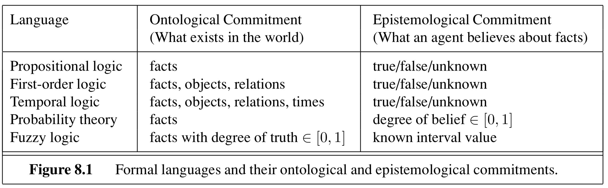
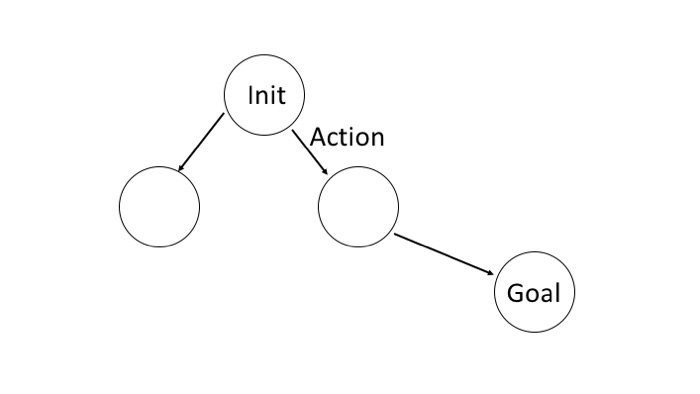

<!-- .slide: data-transition="convex" data-transition-speed="medium"-->

<h1> artificial intelligence </h1>
*press esc to navigate slides*

**<a href="https://twitter.com/chandan_singh96">@chandan_singh96</a>**

# uninformed search

## the setup

1. initial state: $s_0$
2. actions at each state: go($s_1$), go($s_2$)
3. transition model: result($s_0$, go($s_1$)) = $s_1$
4. goal states: $s_\text{goal}$
5. path cost function: cost($s_0$, a, $s_1$)

## how to search

- TREE-SEARCH - continuously expand the frontier
  - *frontier*  = set of all leaf nodes available to expand
- GRAPH-SEARCH - also keep set of visited states

## metrics

- *optimal* - finds best solution
- *complete* - terminates in finite steps
- *time, space complexity*
  - *search cost* - just time/memory
- *total cost* - search cost + *path cost*

##  summary

# A* & Heuristics

## informed search

- *informed search* - use $g(n)$ and $h(n)$
  - *g(n)*:  cost from start to n
  - *heuristic h(n)*: cost from n to goal
- *best-first* - choose nodes with best f
  - f=g: uniform-cost search
  - f=h: greedy best-first search
- $A^*$: $f(n) = g(n) + h(n)$

## admissible

- *admissible*: $h(n)$ never overestimates
- $\implies A^*$ (with tree search) is optimal and complete

## consistent

- *consistent*: $h(n) \leq cost(n \to n') + h(n')$
  - monotonic
- $\implies A^*$ (with graph search) is optimal and complete 

## optimally efficient

- *consistent* $\implies$ *optimally efficient* (guaranteed to expand fewest nodes) 
  - never re-open a node
- weaknesses
  - must store all nodes in memory

## memory-bounded heuristic search

- *iterative-deepening* $A^*$ - cutoff f-cost
- *recursive best-first search*
  - each selected node backs up best f alternative
  - if exceeding this, rewind
  - when rewinding, replace nodes with with best child f
- $SMA^*$ - simplified memory-bounded
  -  when memory full, collapse worst leaf

##  recursive best-first

## heuristic functions

- want big h(n) because we expand everything with $f(n) < C^*$
  - $h_1$ dominates $h_2$ if $h_1(n) \geq h_2(n) \: \forall \: n$
  - combining heuristics: pick $h(n) = max[h_1(n), ..., h_m(n)]$

- *relaxed problem* yields admissible heuristics

  - ex. 8-tile solver

# local search

## definitions

- *local search* looks for solution not path ~ like optimization
- maintains only *current node* and its neighbors

## discrete space

- *hill-climbing* = *greedy local search* 
  - stochastic hill climbing
  - random-restart hill climbing
- *simulated annealing* - pick random move
  - if better accept
  - else accept with probability $\exp(\Delta f / T_t)$
- *local beam search* - pick k starts, then choose the best k states from their neighbors
  - *stochastic beam search* - pick best k with prob proportional to how good they are

## genetic algorithms

*schema* - representation

## continuous space

- could just discretize neighborhood of each state

- SGD: *line search* - double $\alpha$ until f increases
- *Newton-Raphson* method: $x = x - H_f^{-1} (x) \nabla f(x)$

# constraint satisfaction problems

## definitions

- variables, domains, constraints
- goal: *assignment* of variables
  - *consistent* - doesn't violate constraints
  - *complete* - every variable is assigned
- 2 ways to solve
  1. local search - assign all variables and then alter
  2. backtracking search (with inference) - assign one at a time

## example

## 1 - local search for csps
- start with some assignment to variables
- *min-conflicts* heuristic - change variable to minimize conflicts
  - can escape plateaus with *tabu search* - keep small list of visited states
  - could use *constraint weighting*

## 2 - backtracking
- depth-first search that backtracks when no legal values left
  - b1 - variable and value ordering
  - b2 - interleaving search and inference
  - b3 - intelligent backtracking - looking backward

## b1 - variable and value ordering

- *commutative*
- heuristics
  - *minimum-remaining-values*
  - *degree* - pick variable involved in most constraints
  - *least-constraining-value*

## b2 - interleaving search and inference

- *forward checking* - after assigning, check arc-consistency on neighbors
- *maintaining arc consistency (MAC)* - after assigning, arc consistency initialized on neighbors

## constraint graph

*this is not the search graph!*

## inference

- **constraint propagation** uses constraints to prune domains of variables
- finite-domain constraint $\equiv$  set of binary constraints w/ auxiliary variables
  - ex. *dual graph transformation*: constraint $\to$ variable, shared variables $\to$ edges

## basic constraint propagation

- *node consistency* - unary constraints
- *arc consistency* - satisfy binary constraints (AC-3 algorithm)
  - for each arc, apply it
    - if things changed, re-add all the neighboring arcs to the set
  - $O(cd^3)$ where $d = \vert domain\vert $, c = num arcs

## advanced constraint propagation

- *path consistency* - consider constraints on triplets - PC-2 algorithm
  - extends to *k-consistency*
  - *strongly k-consistent* - also (k-1), ..., 1-consistent
    - $\implies O(k^2d)$ to solve
- global constraints

## b3 - intelligent backtracking

- *conflict set* for each node (list of variable assignments that deleted things from its domain)
- *backjumping*  - backtracks to most recent assignment in conflict set
- *conflict-directed backjumping* 
  - let $X_j$ be current variable and $conf(X_j)$ be conflict set. If every possible value for $X_j$ fails, backjump to the most recent variable $X_i$ in $conf(X_j)$ and set $conf(X_i) = conf(X_i) \cup conf(X_j) - X_i$
- *constraint learning* - finding min set of assigments from conflict set that causes problem

## structure of problems
- connected components of constraint graph are independent subproblems
- *tree* - any 2 variables are connected by only one path
  - *directed arc consistency* - ordered variables $X_i$, every $X_i$ is consistent with each $X_j$ for j>i
    - tree with n nodes can be made directed arc-consisten in $O(n)$ steps - $O(nd^2)$

## making trees

1. assign variables so remaining variables form a tree
  - assigned variables called *cycle cutset* with size c
  - $O[d^c \cdot (n-c) d^2]$
  - finding smallest cutset is hard, but can use approximation called *cutset conditioning*
2. *tree decomposition* - view each subproblem as a mega-variable
  - *tree width* w - size of largest subproblem - 1
  - solvable in $O(n d^{w+1})$

# propositional logic

- declarative vs procedural (knowing how to ride a bike)
- horn clause - at most one positive
  - definite clause - exactly one positive
  - goal clause - 0 positive

## TT-ENTAILS: check everything
- forward-chaining/backward chaining

## DPLL: TT-ENTAILS with 3 improvements
  - early termination
  - pure symbols
  - unit clause

## agents
  - use A* with entailment
  - SATPLAN
- propositional logic: facts - true/false/unknown

# first-order logic

- first-order logic: add objects, relations, quantifiers ($\exists, \forall$)

  - unification

## inference 1

- simple: first-order logic forward-chaining: FOL-FC-ASK

  - efficient forward chaining
    - conjunct ordering
    - ignore redundanat rules
    - ignore irrelevant facts w/ backward chaining

## inference 2

- backward-chaining: FOL-BC-ASK
  - generator - returns multiple times

# classical planning

- requires 4 things (like search w/out path cost function)
  - initial state
  - actions
  - transitions
  - goals

## action example

- $Action(Fly(p, from, to))$:
	- PRECOND: $At(p, from) \land Plane(p) \land Airport(from) \land Airport(to)$
	- EFFECT: $\neg At(p, from) \land At(p, to)$
  - can only use variables in the precondition

## planning as search

## algorithms

1. forward state-space search
   1. inefficient, but preferred because good heuristics
2. backward
   1. start with a set of things in the goal (and other fluents can have any value)

## heuristics

- ex. ignore preconditions
- ex. ignore delete lists - remove all negative literals
- ex. **state abstractions** - many-to-one mapping from states $\to$ abstract states
  - ex. ignore some fluents

# knowledge repr.

- compositionality
- intrinsic / extrinsic properties
- event calculus

# decisions + rl

## decision theory

- $EU(a|e) = \sum_{s'} P(s'|s, a) U(s')$
- $MEU(e) = \underset{a}{\max} EU(a|e)$
- $VPI(T) = E_T[MEU(e, t)] - MEU(e)$

## mdps

$\pi(s) = \underset{\pi}{\text{argmax}} \:U^\pi (s)$

- value iteration: $U(s) = R(s) + \gamma MEU(s)$ (Bellman eqn)
- policy iteration: $U(s) = R(s) + \gamma EU(s)$

## passive rl

*given $\pi$, find $U(s)$*

- ADP: find $P(s'|s, a)$, $R(s) \to $ plug into Bellman eqn
- TD: when $s \to s'$: $U(s) = U(s) + \alpha[R(s) + \gamma U(s') - U(s)]$

## active rl

*find $\pi$, maybe maximize rewards along the way*

*here only Q-learning: $U(s) = \underset{a}{\max}Q(s, a)$*

- ADP: $Q(s, a) =  R(s) + \alpha[\sum_{s'} P(s'|s, a)\underset{\alpha}{\max}Q(s', a')]$
- TD: when $s\to s'$: $Q(s, a) = Q(s, a) + \alpha[R(s) + \gamma \underset{a}{\max}Q(s', a') - Q(s, a)]$
- SARSA: when $s\to s'$: $Q(s, a) = Q(s, a) + \alpha[R(s) + \gamma Q(s', a') - Q(s, a)]$