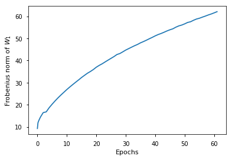
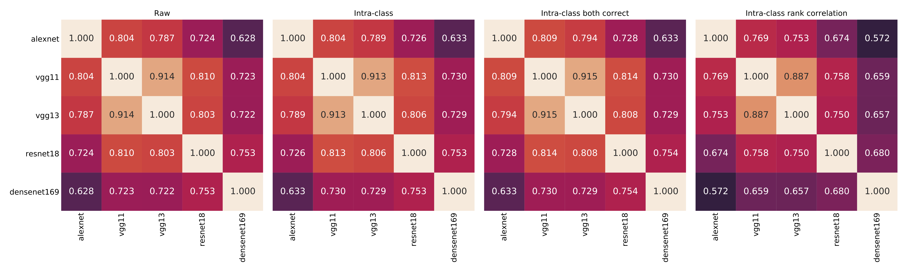
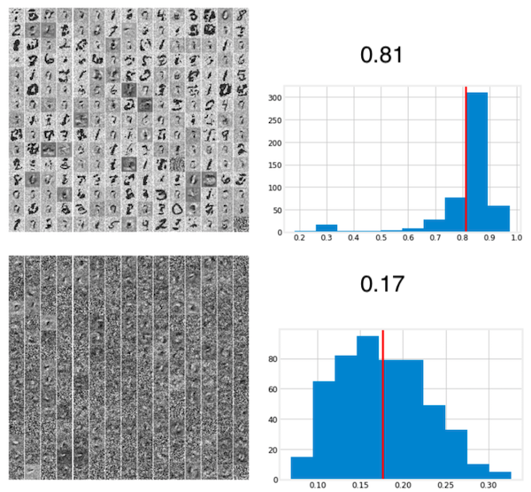
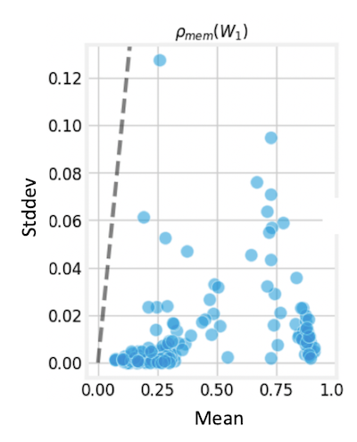

<h1>  what do neural network weights reliably learn? </h1>
<h3> chandan singh </h3> 
## why analyze neural net weights?

- neural nets learn useful representations
- understanding weights might help with engineering
- might help us understand the brain
- approaches: neuroscience learning rules, unsupervised learning, NN analysis, feature engineering

## related work

- engineering strong feature representations (mallat 12, huang et al. 06)
- sparse coding (olshausen & field 96)
- analyzing weight matrices (denil et al. 13, martin et al. 18)
- analyzing neural activations (tishby et al. 15, 17)

## a layer can learn its input

$$W^{\text{final}} = W^{\text{init}} + \color{cyan}{W^{\text{proj}}}\\\ \color{cyan}{W^{\text{proj}}} \in col(X)$$

this is a consequence of the learning rule:

$$Y = g(W X)$$

$$\frac{\partial L} {\partial W} = \frac{\partial L} {\partial g} (W X) \cdot X$$

## weights sometimes grow (especially when using ADAM)

$\implies \color{cyan}{W^{\text{proj}}}$ dominates

# 1st layer weight viz (optimizer = adam)

## 1st layer weight viz (optimizer = sgd)

## mnist sparse dictionary ($\lambda$ = 10)

## mnist sparse dictionary ($\lambda$ = 100)

# which layer?

## why the first layer?: training mlps

|    |  Linear Classifier    |  MLP-2 First-Layer    | MLP-2 Last-layer
| -- | -- | -- |
| MNIST |   0.92   |  **0.96**    | 0.90

## why the first layer?: training mlps

|    |  Linear Classifier    | Linear + Lenet First-layer
| -- | -- |
| MNIST |   0.92   | **0.98**

## 1st and last layer norms grow

# different nets learn the same thing

## adam weights can be pruned more

## (val) preds correlate

## top k match

# memorization

## quantifying memorization

## memorization is stable

# hyperparameters that increase memorization

- **ADAM over SGD**
- smaller batch size
- larger learning rate
- larger width
- etc.

## how does ADAM cause memorization?

- ADAM disproportionately increases first layer's learning rate
- increasing only first layer's learning rate qualitatively reproduces ADAM

## going deeper: memorization in deep cnns

# linear experiments

## bias vs var

## mse changes based on distr

## mse with pcs

## logistic regression with cvs (score is mse)

## linear regression with cvs (score is mse)

