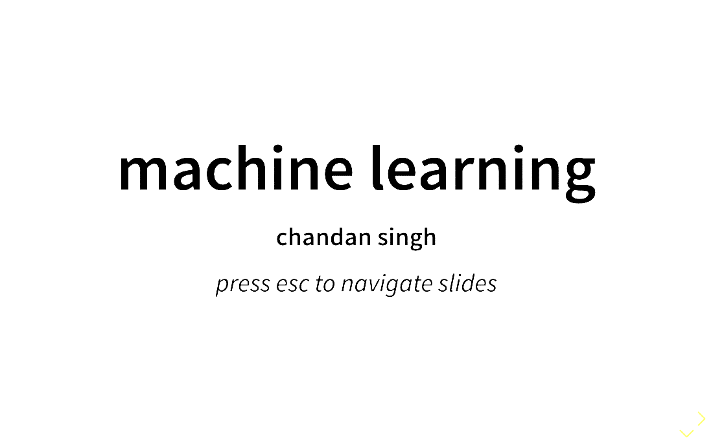
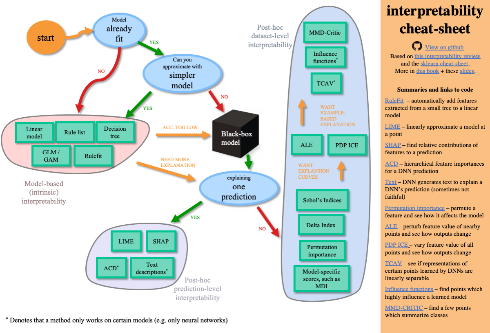
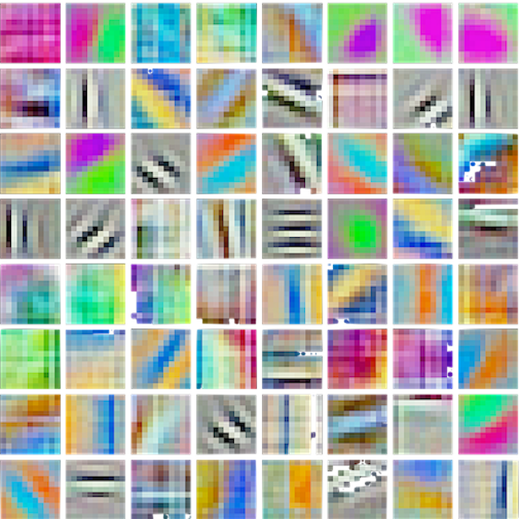
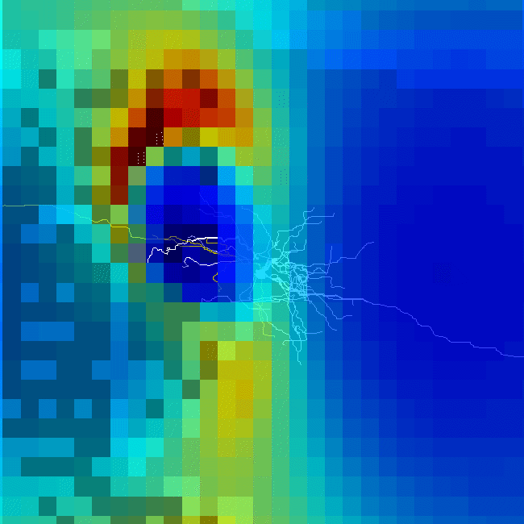

# source for https://csinva.github.io

**contains [slides](pres), [research overviews](_research_ovws), [notes](_notes),  [blog posts](_blog), links to code/research, and personal info**

## slides

the [pres](pres) folder contains source for presentations, including [ml slides](https://csinva.github.io/pres/189/#/) from teaching intro machine learning at berkeley - the source is in markdown and is easily editable

## research overviews

overviews and summaries of recent papers in different research areas in the [research_ovws](_notes/research_ovws) folder (e.g. [interpretable ml](https://github.com/csinva/csinva.github.io/blob/master/_research_ovws/ovw_interp.md),  [theoretical ml](https://github.com/csinva/csinva.github.io/blob/master/_research_ovws/ovw_dl_theory.md),  [complexity in ml](https://github.com/csinva/csinva.github.io/blob/master/_research_ovws/ovw_complexity.md), [scattering transform](https://github.com/csinva/csinva.github.io/blob/master/_research_ovws/ovw_scat.md), [dl in neuroscience](https://github.com/csinva/csinva.github.io/blob/master/_research_ovws/ovw_dl_for_neuro.md))

## notes

the [_notes](_notes) folder contains markdown notes for many different classes and areas between computer science, statistics, and neuroscience

## code

links to research code, such as these repos for interpretable machine learning (e.g. [hierarchical-dnn-interpretations](https://github.com/csinva/hierarchical_dnn_interpretations), [disentangled-attribution-curves](https://github.com/csinva/disentangled_attribution_curves)) and miscellaneous repos for data science (e.g. [pytorch-pretrained-gans](https://github.com/csinva/pytorch_gan_pretrained))

## blog posts

blog on various aspects of machine learning / statistics / neuroscience advancements

| [interpretability](https://csinva.github.io/blog/research/interp) | [connectomics](https://csinva.github.io/blog/research/connectomics) |
| ------------------------------------------------------------ | ------------------------------------------------------------ |
|                                                               |                         |

# reference

- for updates, star the repo or follow [@chandan_singh96](https://twitter.com/chandan_singh96)
- uses [timeline theme](http://kirbyt.github.io/timeline-jekyll-theme)
- uses [particles.js](https://vincentgarreau.com/particles.js/)
