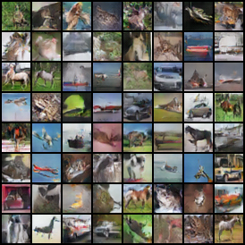
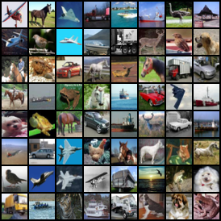

# source for chandan's personal website (https://csinva.github.io)

**contains notes, slides, blog posts, and personal information**

## slides

- contains source for many presentations, including [slides](https://csinva.github.io/pres/189/#/) from teaching intro machine learning at berkeley:

## notes

- notes on different research areas in the [_notes/research](_notes/research) folder (e.g. interpretability, complexity)

- the [_notes](_notes) folder also contains markdown notes for many different classes and areas

## blog posts

- blogs on different research areas such as [interpretability](https://csinva.github.io/notes/blog/interpretability) and [connectomics](https://csinva.github.io/notes/blog/connectomics).

  

## code

- links to many simple coding projects, such as this [github repo](https://github.com/csinva/pytorch_gan_pretrained), which contains code for simple pre-trained gans

| generated samples                                            | data samples     |
| ------------------------------------------------------------ | ----------------------------------------------------- |
|  |  |

# reference

- uses theme from [here](http://kirbyt.github.io/timeline-jekyll-theme)
- uses [particles.js](https://vincentgarreau.com/particles.js/)
