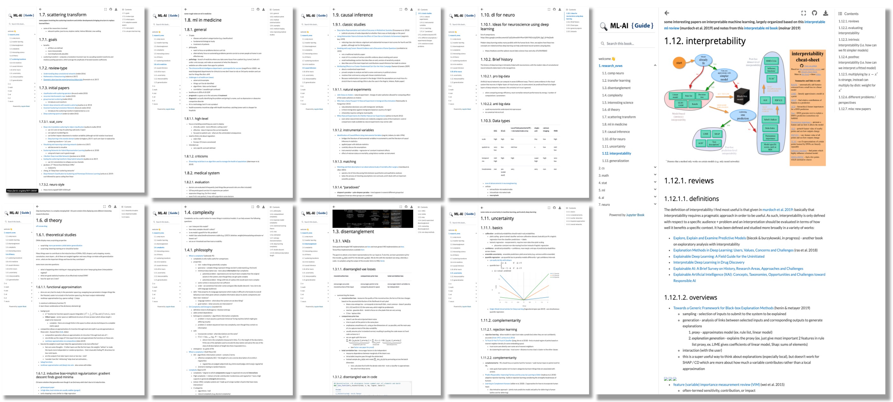
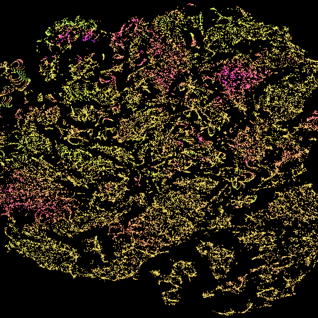

<h1 align="center">Source for <a href="https://csinva.github.io">csinva.io</a></h1>

  <a href="pres">Slides</a> •
  <a href="_notes/research_ovws">Research overviews</a> •
  <a href="_notes/cheat_sheets">Cheat sheets</a> •
  <a href="_notes">Notes</a>
   
  <a href="_blog">Posts</a> •
  <a href="#code">Research links</a>  •
  <a href="https://scholar.google.com/citations?hl=en&user=XpttKK8AAAAJ&view_op=list_works&sortby=pubdate">Personal info</a>
   
  <a href="https://twitter.com/csinva_">@csinva_</a>

## Slides

The <a href="pres">pres</a> folder contains source for presentations, including <a href="https://csinva.github.io/pres/189/#/">ML slides</a> from teaching machine learning at berkeley

The source is in markdown (<a href="https://csinva.io/blog/misc/reveal_md_enhanced/readme">built with reveal-md</a>) and is easily editable / exportable
<ul>
	<li><a href="https://csinva.io/pres/189/#/">ML slides (berkeley cs 189)</a></li>
	<li><a href="https://csinva.io/pres/188/#/">AI slides (berkeley cs 188)</a></li>   <li><a href="https://docs.google.com/presentation/d/1RIdbV279r20marRrN0b1bu2z9STkrivsMDa_Dauk8kE/present?slide=id.p">Interpretability workshop</a></li> 
	<li><a href="https://docs.google.com/presentation/d/1cdzZsyRYRs9GiR9s2-V7OO8oIcaabT5TVJFGR9qk_HY/present?slide=id.p">Disentanngled interpretations</a></li> 
</ul> 

## Research and class notes

The <a href="_notes/research_ovws">research_ovws</a> folder contains overviews and summaries of recent papers in different research areas

<ul>
<li><a href="https://github.com/csinva/csinva.github.io/blob/master/_notes/research_ovws/ovw_interp.md">Interpretability</a></li>
<li><a href="https://csinva.io/notes/research_ovws/ovw_causal_inference.html">Causal inference</a></li>
<li><a href="https://csinva.io/notes/research_ovws/ovw_transfer_learning.html">Transfer learning</a></li>
<li><a href="https://csinva.io/notes/research_ovws/ovw_uncertainty.html">Uncertainty</a></li>
<li><a href="https://github.com/csinva/csinva.github.io/blob/master/_notes/research_ovws/ovw_dl_theory.md">DL theory</a></li>
<li><a href="https://github.com/csinva/csinva.github.io/blob/master/_notes/research_ovws/ovw_complexity.md">Complexity</a></li>
<li><a href="https://github.com/csinva/csinva.github.io/blob/master/_notes/research_ovws/ovw_scat.md">Scattering transform</a></li>
<li><a href="https://github.com/csinva/csinva.github.io/blob/master/_notes/research_ovws/ovw_dl_for_neuro.md">DL in neuroscience</a></li>
</ul>

The <a href="_notes">_notes</a> folder contains markdown notes and <a href="_notes/cheat_sheets">cheat-sheets</a> for many different courses and areas between computer science, statistics, and neuroscience

<ul>
  <li><a href="https://csinva.io/notes/cheat_sheets/interp.svg">Interpretability cheat sheet</a></li>
  <li><a href="https://csinva.io/notes/neuro/comp_neuro.html">Computational neuroscience</a></li>
  <li><a href="https://csinva.io/notes/stat/causal_inference.html">Causal inference notes</a></li>
  <li><a href="https://csinva.io/notes/ml/classification.html">Classification</a></li>
  <li><a href="https://csinva.io/notes/math/linear_algebra.html">Linear algebra</a></li>
  <li><a href="https://csinva.io/notes/stat/info_theory.html">Info theory</a></li>
  <li><a href="https://csinva.io/notes/ml/comp_vision.html">Computer vision</a></li>
  <li><a href="https://csinva.io/#:~:text=A%20rough%20set%20of%20notes%20which%20may%20serve%20as%20useful%20reference%20for%20people%20in%20machine%20learning%20/%20neuroscience.">Way more notes here</a></li>
</ul>

## Code

Links/explanations of research code, such as these repos:
| Interpretable machine learning                               | Interpretable deep learning                                  | Deep learning fun                                            |
| :----------------------------------------------------------- | ------------------------------------------------------------ | ------------------------------------------------------------ |
| [imodels](https://github.com/csinva/interpretability-implementations-demos): transparent model fitting, [DAC](https://github.com/csinva/disentangled_attribution_curves): disentangled attribution curves | [ACD](https://github.com/csinva/hierarchical-dnn-interpretations): hierarchical interpretations, [TRIM](https://github.com/csinva/transformation-importance): interpreting transformations, [CDEP](https://github.com/laura-rieger/deep-explanation-penalization): penalizing explanations, [AWD](https://github.com/Yu-Group/adaptive-wavelet-distillation): adaptive wavelet distillation | [GAN/VAE](https://github.com/csinva/pytorch_gan_pretrained): demo models, [paper-title generator](https://github.com/csinva/gpt2-paper-title-generator) with gpt2 |

## Posts

Posts on various aspects of machine learning / statistics / neuroscience advancements

| [Interpretability](https://bair.berkeley.edu/blog/2021/09/28/wavelet/) | [Connectomics](https://csinva.github.io/blog/research/connectomics) | [Disentanglement](https://csinva.io/notes/research_ovws/ovw_disentanglement.html) |
| ------------------------------------------------------------ | ------------------------------------------------------------ | ------------------------------------------------------------ |
|                                   |                                    |                                |

# Reference

- For updates, star the repo or follow [@csinva_](https://twitter.com/csinva_)
- Feel free to use openly!
- Built with [jekyll](https://jekyllrb.com/) | [github pages](https://pages.github.com/) | [timeline theme](http://kirbyt.github.io/timeline-jekyll-theme) | [particles.js](https://vincentgarreau.com/particles.js/) | [jupyterbook](https://jupyterbook.org/intro.html)
